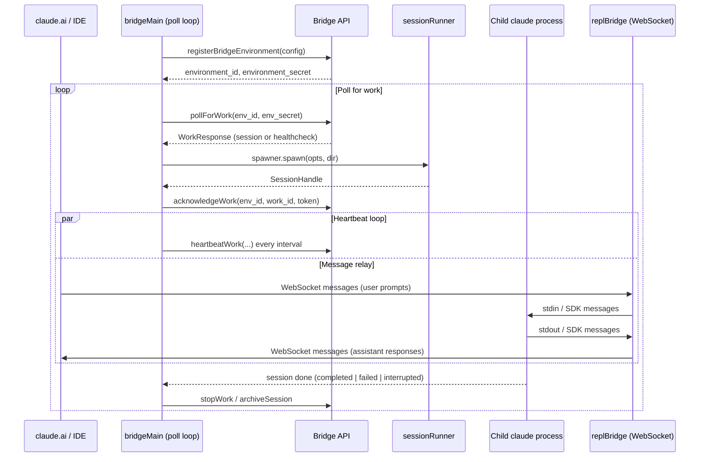

# Bridge System

## 1. Purpose

The bridge system connects the Claude Code CLI to the claude.ai web platform, enabling "Remote Control" sessions where users can drive the CLI from the browser. It registers the local machine as a named environment, polls for work assignments (sessions), spawns child `claude` processes to handle each session, and proxies bidirectional WebSocket messaging between the IDE/browser and the local process.

## 2. Key Files

| File | Size | Role |
|------|------|------|
| `src/bridge/bridgeMain.ts` | 112.9 KB | Main poll-and-dispatch loop (`runBridgeLoop`) |
| `src/bridge/replBridge.ts` | 98.2 KB | Per-session REPL bridge; manages the WebSocket lifecycle for one session |
| `src/bridge/remoteBridgeCore.ts` | 38.5 KB | Core transport and reconnect logic for remote sessions |
| `src/bridge/initReplBridge.ts` | 23.3 KB | Session initialization: bootstrap, git-worktree setup, initial messages |
| `src/bridge/bridgeMessaging.ts` | 15.3 KB | Stateless transport helpers: ingress parsing, echo dedup, control routing |
| `src/bridge/sessionRunner.ts` | 17.6 KB | Child-process spawner (`SessionSpawner`) |
| `src/bridge/jwtUtils.ts` | 9.2 KB | JWT refresh scheduler for session ingress tokens |
| `src/bridge/trustedDevice.ts` | 7.6 KB | Trusted-device token management |
| `src/bridge/capacityWake.ts` | 1.8 KB | Wake signal to unblock the at-capacity sleep early |
| `src/bridge/types.ts` | 9.9 KB | Protocol types and dependency interfaces |

## 3. Data Flow



### Capacity management

When `activeSessions.size >= config.maxSessions` the poll loop sleeps until a session finishes. `createCapacityWake()` provides a signal that fires on `onSessionDone`, waking the sleep early so the bridge can immediately accept new work without waiting for the full backoff interval.

## 4. Core Types

```typescript
// src/bridge/types.ts

export type BridgeConfig = {
  dir: string
  machineName: string
  branch: string
  gitRepoUrl: string | null
  maxSessions: number
  spawnMode: SpawnMode   // 'single-session' | 'worktree' | 'same-dir'
  bridgeId: string       // client-generated UUID for this bridge instance
  environmentId: string  // client-generated UUID for idempotent registration
  apiBaseUrl: string
  sessionIngressUrl: string
  sessionTimeoutMs?: number
}

export type WorkSecret = {
  version: number
  session_ingress_token: string
  api_base_url: string
  auth: Array<{ type: string; token: string }>
  claude_code_args?: Record<string, string> | null
  mcp_config?: unknown | null
  environment_variables?: Record<string, string> | null
  use_code_sessions?: boolean  // CCR v2 selector
}

export type SessionHandle = {
  sessionId: string
  done: Promise<SessionDoneStatus>
  kill(): void
  forceKill(): void
  activities: SessionActivity[]
  currentActivity: SessionActivity | null
  accessToken: string
  updateAccessToken(token: string): void
  writeStdin(data: string): void
}

export type SessionSpawner = {
  spawn(opts: SessionSpawnOpts, dir: string): SessionHandle
}

export type BridgeApiClient = {
  registerBridgeEnvironment(config: BridgeConfig): Promise<{...}>
  pollForWork(...): Promise<WorkResponse | null>
  acknowledgeWork(...): Promise<void>
  heartbeatWork(...): Promise<{ lease_extended: boolean; state: string }>
  stopWork(...): Promise<void>
  reconnectSession(...): Promise<void>
  deregisterEnvironment(...): Promise<void>
  sendPermissionResponseEvent(...): Promise<void>
  archiveSession(...): Promise<void>
}
```

### Message routing (bridgeMessaging.ts)

```typescript
export function handleIngressMessage(
  data: string,
  recentPostedUUIDs: BoundedUUIDSet,
  recentInboundUUIDs: BoundedUUIDSet,
  onInboundMessage: ((msg: SDKMessage) => void | Promise<void>) | undefined,
  onPermissionResponse?: (response: SDKControlResponse) => void,
  onControlRequest?: (request: SDKControlRequest) => void,
): void
```

Message types handled:
- `control_response` — permission decisions sent back to the session
- `control_request` — server-initiated commands (`initialize`, `set_model`, `can_use_tool`)
- `user` — forwarded to the REPL as inbound prompts; echo-deduped via UUID sets

## 5. Integration Points

| Subsystem | How it connects |
|-----------|-----------------|
| **Analytics** | `logEvent` / `logEventAsync` for session lifecycle, message counts, reconnects |
| **JWT / Auth** | `jwtUtils.ts` schedules token refresh; `trustedDevice.ts` manages device tokens; `workSecret.ts` decodes per-session credentials |
| **Git worktrees** | `initReplBridge.ts` calls `createAgentWorktree` when `spawnMode === 'worktree'`; removed on session close |
| **CLI entrypoint** | `bridgeMain.ts` exports `runBridgeLoop`; called from the `remote-control` CLI command in `entrypoints/` |
| **Feature gates** | GrowthBook gates (`tengu_ccr_bridge_multi_session`, `tengu_bridge_repl_v2_cse_shim_enabled`) control multi-session spawning and transport variants |
| **Poll config** | `pollConfig.ts` / `pollConfigDefaults.ts` tune intervals; `getPollIntervalConfig` selects config by gate |

## 6. Design Decisions

**Dependency injection via interfaces.** `BridgeApiClient`, `SessionSpawner`, and `BridgeLogger` are interfaces injected into `runBridgeLoop`. This decouples transport from session management and makes the core loop unit-testable without live HTTP.

**Bounded UUID dedup sets.** Echo suppression uses two `BoundedUUIDSet` instances (posted UUIDs, inbound UUIDs) rather than unbounded maps. This prevents memory growth in long-running bridges while still catching the dominant replay-on-reconnect cases.

**Exponential backoff with give-up budget.** `BackoffConfig` defines separate budgets for connection errors (`connGiveUpMs`) and general errors (`generalGiveUpMs`). The default gives up after 10 minutes of continuous failure rather than retrying forever.

**Sleep-wake detection.** The poll loop checks the wall-clock delta between ticks. If the gap exceeds `2 × connCapMs`, it treats the interval as a system sleep/wake event and resets the error budget so a fresh reconnect doesn't immediately exhaust the give-up timer.

**JWT token layering.** Sessions carry two distinct tokens: the `session_ingress_token` from `WorkSecret` (used for heartbeats and permission responses via `SessionIngressAuth`, no DB hit) and the OAuth token refreshed by `createTokenRefreshScheduler` (used for long-lived API calls). Heartbeats intentionally use the cheaper ingress token.

**SpawnMode isolation.** The `worktree` mode creates an isolated git worktree per session so concurrent sessions on the same repo cannot stomp each other's uncommitted changes. `same-dir` trades safety for simplicity when worktree overhead is undesirable.
