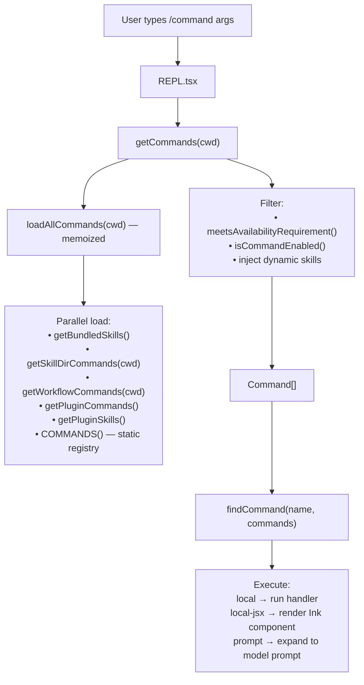

# Command System

## 1. Purpose

The command system manages the slash commands available in Claude Code's interactive REPL (e.g., `/help`, `/compact`, `/model`). Commands are distinct from tools: tools are invoked by the model during inference, while commands are invoked directly by the user via the `/` prefix. The registry assembles commands lazily from built-ins, skills loaded from disk, plugins, and workflow scripts, then filters them by feature flags and auth state on every request.

## 2. Key Files

| File | Size | Role |
|---|---|---|
| `src/commands.ts` | ~755 lines | Central registry: `COMMANDS()`, `getCommands()`, `loadAllCommands()`, `INTERNAL_ONLY_COMMANDS`, cache-clearing utilities |
| `src/types/command.ts` | — | `Command`, `PromptCommand`, `LocalCommandResult`, `CommandBase` type definitions |
| `src/commands/*/` | ~60 directories | Individual command implementations |
| `src/skills/loadSkillsDir.ts` | — | Loads `.md` skill files from `~/.claude/skills/` and project `.claude/skills/` |
| `src/skills/bundledSkills.ts` | — | Registers bundled skills (feature-flag gated, e.g., KAIROS_DREAM, REVIEW_ARTIFACT) |
| `src/utils/plugins/loadPluginCommands.ts` | — | Loads commands and skills from installed plugins |
| `src/tools/WorkflowTool/createWorkflowCommand.ts` | — | Creates `Command` objects from `WORKFLOW_SCRIPTS`-gated workflow definitions |

## 3. Data Flow



### Command Lifecycle

1. **Parse**: User input is split at the first space into `name` and `args`.
2. **Validate**: `findCommand()` checks `name`, `aliases`, and `getCommandName()`.
3. **Availability check**: `meetsAvailabilityRequirement()` gates commands behind `claude-ai` or `console` auth.
4. **Enable check**: `isCommandEnabled()` runs the command's own `isEnabled()` predicate (feature flags, env vars).
5. **Execute**: Dispatch by `cmd.type`:
   - `'local'` — synchronous handler returns `LocalCommandResult` (text)
   - `'local-jsx'` — handler returns a React node rendered by Ink
   - `'prompt'` — `getPromptForCommand()` expands to a string sent to the model

## 4. Core Types

```typescript
// From src/types/command.ts
type CommandBase = {
  name: string
  description: string
  aliases?: string[]
  availability?: ('claude-ai' | 'console')[]
  isEnabled?(): boolean
  source?: 'builtin' | 'bundled' | 'mcp' | 'plugin' | SettingSource
  loadedFrom?: 'skills' | 'commands_DEPRECATED' | 'bundled' | 'plugin' | 'mcp'
  disableModelInvocation?: boolean
  hasUserSpecifiedDescription?: boolean
  whenToUse?: string
  kind?: 'workflow'
}

type PromptCommand = CommandBase & {
  type: 'prompt'
  contentLength: number
  progressMessage: string
  getPromptForCommand(
    args: string,
    context: LocalJSXCommandContext,
  ): Promise<string>
}

// Union: all command types
type Command = LocalCommand | LocalJSXCommand | PromptCommand
```

### Feature-flag-gated commands (examples)

| Flag | Command |
|---|---|
| `PROACTIVE` or `KAIROS` | `proactive`, `SleepTool`-related commands |
| `KAIROS` | `assistantCommand`, `briefCommand` |
| `BRIDGE_MODE` | `bridge` |
| `DAEMON` + `BRIDGE_MODE` | `remoteControlServer` |
| `VOICE_MODE` | `voice` |
| `HISTORY_SNIP` | `forceSnip` |
| `WORKFLOW_SCRIPTS` | `workflowsCmd` |
| `CCR_REMOTE_SETUP` | `webCmd` |
| `KAIROS_GITHUB_WEBHOOKS` | `subscribePr` |
| `ULTRAPLAN` | `ultraplan` |
| `TORCH` | `torch` |
| `UDS_INBOX` | `peersCmd` |
| `FORK_SUBAGENT` | `forkCmd` |
| `BUDDY` | `buddy` |

`USER_TYPE === 'ant'` gates `agentsPlatform` and all `INTERNAL_ONLY_COMMANDS` (backfill-sessions, commit, issue, etc.).

## 5. Integration Points

- **Tool system**: `SkillTool` calls `getSkillToolCommands()` to present prompt-type commands to the model as invocable skills. `WorkflowTool` similarly surfaces workflow commands.
- **REPL**: `REPL.tsx` calls `getCommands(cwd)` on every turn to build the typeahead list. It calls `clearCommandsCache()` when plugins or skills change.
- **Permission system**: The `/permissions` command is a built-in `local-jsx` command that reads and writes `ToolPermissionContext` through `AppState`.
- **Bridge/Remote**: `BRIDGE_SAFE_COMMANDS` and `REMOTE_SAFE_COMMANDS` sets control which commands are permitted over mobile/remote channels. `isBridgeSafeCommand()` is the predicate.
- **MCP**: MCP servers can expose `prompt`-type resources that are loaded as `Command` objects via `getMcpSkillCommands()` (gated by `MCP_SKILLS` flag).

## 6. Design Decisions

- **Memoized lazy loading**: `loadAllCommands` is memoized by `cwd` using lodash `memoize`. The static `COMMANDS()` array is also memoized — both avoid re-parsing disk on every keystroke. Cache is explicitly invalidated via `clearCommandsCache()` when dynamic state changes.
- **Dynamic skills**: Skills discovered during file operations (e.g., a new `.claude/skills/` file found mid-session) are injected via `getDynamicSkills()` without busting the full memoization layer, using `clearCommandMemoizationCaches()` only.
- **Lazy dynamic imports for heavy modules**: The `/insights` command (113 KB, 3200-line module) is shimmed as a static `PromptCommand` object that defers `import('./commands/insights.js')` until first invocation, keeping startup fast.
- **Availability vs. isEnabled separation**: `meetsAvailabilityRequirement()` (auth check) is evaluated on every `getCommands()` call because auth state changes mid-session. The heavier `loadAllCommands()` stays memoized. `isEnabled()` (feature flags) is called per-command after the memoized load.
- **Internal-only commands**: `INTERNAL_ONLY_COMMANDS` are only included when `USER_TYPE === 'ant' && !IS_DEMO`, keeping the external build surface clean.
