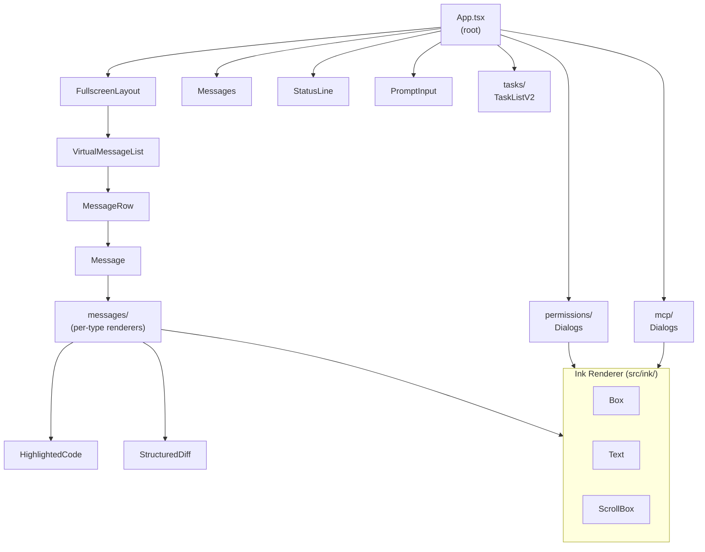

# Component System

## 1. Purpose

`src/components/` contains every application-level React component that makes up the Claude Code terminal UI. Components are organized into 31 subdirectories by feature domain and render entirely through the custom Ink renderer (see `docs/architecture/ink-renderer.md`). The system handles everything from the main conversation view to permission dialogs, diff displays, MCP server management, and agent orchestration UIs.

## 2. Key Files

### Top-level files (113 total, 111 `.tsx` + 2 `.ts`)

| File | Approx. size | Role |
|---|---|---|
| `src/components/Messages.tsx` | 144 KB | Main conversation message list |
| `src/components/LogSelector.tsx` | 196 KB | Log browsing and session selector |
| `src/components/ScrollKeybindingHandler.tsx` | 146 KB | Global scroll keybinding state machine |
| `src/components/VirtualMessageList.tsx` | 145 KB | Virtualized message rendering |
| `src/components/Stats.tsx` | 149 KB | Token/cost/timing statistics panel |
| `src/components/Feedback.tsx` | 86 KB | User feedback and rating flow |
| `src/components/Spinner.tsx` | 86 KB | Animated spinner primitives |
| `src/components/FullscreenLayout.tsx` | 83 KB | Alt-screen full-window layout scaffold |
| `src/components/ConsoleOAuthFlow.tsx` | 78 KB | OAuth authentication flow UI |
| `src/components/App.tsx` | 5 KB | Root application component |

### Subdirectory breakdown

| Directory | Files | Domain |
|---|---|---|
| `messages/` | 34 | Individual message type renderers |
| `permissions/` | 30 | Permission dialogs, approval flows, auto-mode gates |
| `design-system/` | 16 | Shared primitives (colors, typography, layout tokens) |
| `agents/` | 14 | Agent/swarm progress, coordinator status |
| `tasks/` | 12 | Task list, task watcher, background task navigation |
| `mcp/` | 13 | MCP server connection, approval, multiselect dialogs |
| `CustomSelect/` | — | Ink-level multi-choice selector |
| `diff/` | 3 | Structured diff rendering |
| `shell/` | 4 | Shell integration, bash mode |
| `teams/` | 2 | Teammate/shared session views |
| `skills/` | 1 | Skill improvement survey |
| `ui/` | — | Generic UI primitives not in design-system |
| `Settings/` | — | Settings menu, config panels |
| `PromptInput/` | — | Text input, suggestion overlay, input modes |
| `memory/` | — | Memory usage indicator |
| `wizard/` | — | Onboarding wizard |
| `sandbox/` | — | Sandbox violation views |
| `grove/` | — | Grove integration UI |

## 3. Data Flow



All components ultimately render to Ink primitives (`Box`, `Text`, `ScrollBox`, `Button`, etc.) imported from `src/ink.js`. No DOM or browser APIs are used.

## 4. Core Types

Components share a set of cross-cutting prop patterns rather than a single base type. The most common:

```ts
// Message rendering (src/components/Message.tsx)
type MessageProps = {
  message: Message           // from src/types/message.ts
  isStreaming: boolean
  isLastMessage: boolean
  // ...tool-use context props
}

// Permission dialogs (src/components/permissions/)
type PermissionDialogProps = {
  tool: Tool
  toolInput: unknown
  onAllow: () => void
  onDeny: () => void
  permissionMode: PermissionMode
}

// App root (src/components/App.tsx)
type AppProps = {
  commands: readonly Command[]
  tools: Tool[]
  messages: Message[]
  // ...AppState slices passed as props
}
```

## 5. Integration Points

- **Custom Ink renderer** (`src/ink/`) — all layout and rendering. Components import `Box`, `Text`, `ScrollBox`, `AlternateScreen`, `Button`, `Link` from `src/ink.js`, never from npm.
- **React hooks** (`src/hooks/`) — application logic hooks (`useTypeahead`, `useReplBridge`, `useGlobalKeybindings`, etc.) are consumed by top-level components.
- **App state** (`src/state/AppState.ts`) — Zustand store accessed via `useAppState` and `useSetAppState`; components subscribe to specific slices to minimize re-renders.
- **Services** (`src/services/`) — components may call service functions directly (e.g., `logEvent` from analytics, `compact` from the compact service) or receive service results as props.
- **Keybindings** (`src/keybindings/`) — components register keybinding contexts via `useRegisterKeybindingContext` and read resolved keystrokes via `useKeybindings`.
- **Ink events** — components attach `onKeyDown`, `onClick`, `onMouseEnter` props to `Box` elements; the Ink event dispatcher routes raw terminal events to the React tree.

## 6. Design Decisions

**Feature-domain directories over component-type directories.** Subdirectories group by product feature (permissions, mcp, tasks) rather than by component type (atoms, molecules, organisms). This keeps related dialogs, sub-components, and utility files co-located.

**Large files are intentional.** Several top-level files (`Messages.tsx` at 144 KB, `VirtualMessageList.tsx` at 145 KB) are large because they own complete rendering logic for their feature rather than splitting into many small files that would require prop-drilling through several layers.

**No CSS-in-JS or stylesheets.** All styling is done via Ink `style` props (maps to Yoga layout + ANSI output). The `design-system/` directory provides shared style constants rather than a stylesheet-based design token system.

**Virtualization for message lists.** `VirtualMessageList.tsx` implements virtual scrolling over the Ink `ScrollBox` to keep render time bounded as conversation history grows. Only visible message rows are mounted in the React tree.

**Permission dialogs are modal.** Components in `permissions/` use the `overlayContext` to claim exclusive keyboard focus, preventing background components from consuming input while a permission dialog is on screen.
