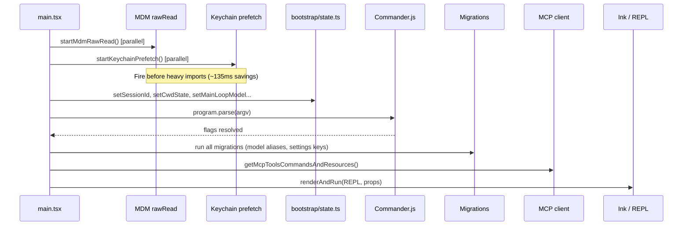
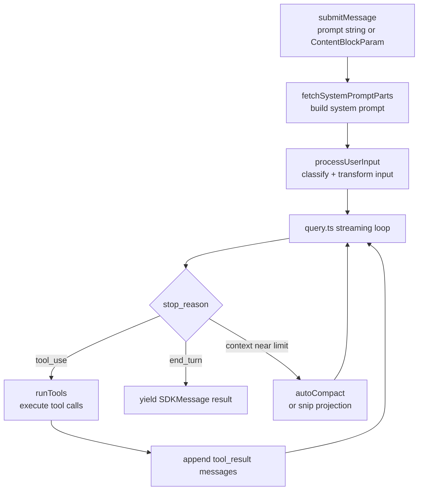

# Core Engine

## 1. Purpose

The core engine encompasses the application bootstrap sequence in `main.tsx`, the LLM orchestration layer in `QueryEngine.ts` and `query.ts`, the system prompt contract defined in `constants/prompts.ts`, and the interactive REPL UI in `screens/REPL.tsx`. Together these form the backbone of every Claude Code session, from process startup through streaming response delivery.

## 2. Key Files

| File | Size | Role |
|------|------|------|
| `src/main.tsx` | 785 KB | Entry point: side-effect prefetches, Commander.js setup, session bootstrap, Ink launch |
| `src/QueryEngine.ts` | 45 KB | Per-conversation turn orchestrator for SDK/headless mode |
| `src/query.ts` | 67 KB | Core streaming query loop, tool execution, auto-compaction |
| `src/constants/prompts.ts` | large | `getSystemPrompt()` — assembles all system prompt sections |
| `src/screens/REPL.tsx` | largest file | Interactive TUI component; React state for messages, permissions, keys |
| `src/bootstrap/state.ts` | medium | Global session state: session ID, model, CWD, budgets |
| `src/query/config.ts` | small | Builds per-request query configuration |
| `src/query/deps.ts` | small | Dependency injection for query loop |

## 3. Data Flow

### Bootstrap Sequence (`main.tsx`)



### QueryEngine Turn (`QueryEngine.ts`)



### System Prompt Assembly (`constants/prompts.ts`)

The `getSystemPrompt()` function stitches together ordered sections, then `resolveSystemPromptSections()` splits them at `SYSTEM_PROMPT_DYNAMIC_BOUNDARY` to enable prompt caching for the static prefix.

```
[static sections]                         [dynamic sections]
  intro | tools | doing tasks | ...  |  __BOUNDARY__  | user context | memory | hooks
                                                ^
                              Everything before this can use global cache scope
```

## 4. Core Types

```typescript
// src/QueryEngine.ts — config passed at construction
export type QueryEngineConfig = {
  cwd: string
  tools: Tools
  commands: Command[]
  mcpClients: MCPServerConnection[]
  agents: AgentDefinition[]
  canUseTool: CanUseToolFn
  getAppState: () => AppState
  setAppState: (f: (prev: AppState) => AppState) => void
  initialMessages?: Message[]
  readFileCache: FileStateCache
  customSystemPrompt?: string
  appendSystemPrompt?: string
  userSpecifiedModel?: string
  fallbackModel?: string
  thinkingConfig?: ThinkingConfig
  maxTurns?: number
  maxBudgetUsd?: number
  taskBudget?: { total: number }
  jsonSchema?: Record<string, unknown>
  snipReplay?: (yieldedSystemMsg: Message, store: Message[]) => { messages: Message[]; executed: boolean } | undefined
}

// src/query.ts — per-request parameters
export type QueryParams = {
  messages: Message[]
  systemPrompt: SystemPrompt
  userContext: { [k: string]: string }
  systemContext: { [k: string]: string }
  canUseTool: CanUseToolFn
  toolUseContext: ToolUseContext
  fallbackModel?: string
  querySource: QuerySource
  maxOutputTokensOverride?: number
  maxTurns?: number
  taskBudget?: { total: number }
  deps?: QueryDeps
}

// src/state/store.ts — generic store powering AppState
export type Store<T> = {
  getState: () => T
  setState: (updater: (prev: T) => T) => void
  subscribe: (listener: Listener) => () => void
}
```

## 5. Integration Points

| Connects To | Via |
|-------------|-----|
| Anthropic API | `src/services/api/claude.ts` — called from `query.ts` streaming loop |
| Tool system | `src/Tool.ts` + `src/tools.ts` — `getTools()` populates `QueryEngineConfig.tools` |
| MCP servers | `src/services/mcp/client.ts` — tools injected into config and system prompt |
| AppState store | `getAppState` / `setAppState` callbacks — REPL owns store; SDK provides closures |
| Compaction | `src/services/compact/autoCompact.ts` + `compact.ts` — triggered inside `query.ts` |
| Hooks | `src/utils/hooks/` — `executeUserPromptSubmitHooks`, `executePostSamplingHooks` |
| Analytics | `logEvent` from `src/services/analytics/index.ts` — emitted at every major event |
| Session storage | `src/utils/sessionStorage.ts` — `recordTranscript`, `flushSessionStorage` |

## 6. Design Decisions

- **QueryEngine vs. query.ts separation**: `QueryEngine` is a class that owns per-session state (message history, file cache, permission denials, usage totals). `query.ts` is a stateless generator function implementing one streaming request/response cycle. This allows the SDK path to use `QueryEngine` directly while the REPL calls `query.ts` with its own state management.
- **SYSTEM_PROMPT_DYNAMIC_BOUNDARY**: A sentinel string separates cacheable static sections from dynamic user/session content. The `splitSysPromptPrefix` utility in `src/utils/api.ts` uses it to apply `scope: 'global'` cache headers only to the stable prefix, saving tokens on every request.
- **Adaptive thinking**: `shouldEnableThinkingByDefault()` returns a `ThinkingConfig` that defaults to `{ type: 'adaptive' }`. This lets the model decide per turn whether to emit thinking blocks, rather than requiring the caller to hard-code it.
- **Snip projection vs. truncation**: In SDK/headless mode, `QueryEngine` truncates history at snip boundaries to bound memory. In interactive REPL mode the full history is kept for scroll-back and a `snipProjection` is computed on demand for the API call.
- **Structured output enforcement**: When a `jsonSchema` is provided and the `SyntheticOutputTool` is present, `registerStructuredOutputEnforcement` hooks into `setAppState` to validate model output against the schema.
- **Max output tokens recovery**: `query.ts` implements a recovery loop (up to `MAX_OUTPUT_TOKENS_RECOVERY_LIMIT = 3`) that retries when the model hits its output limit mid-response, transparently continuing generation. Intermediate error messages are withheld from SDK callers until the recovery outcome is known.
