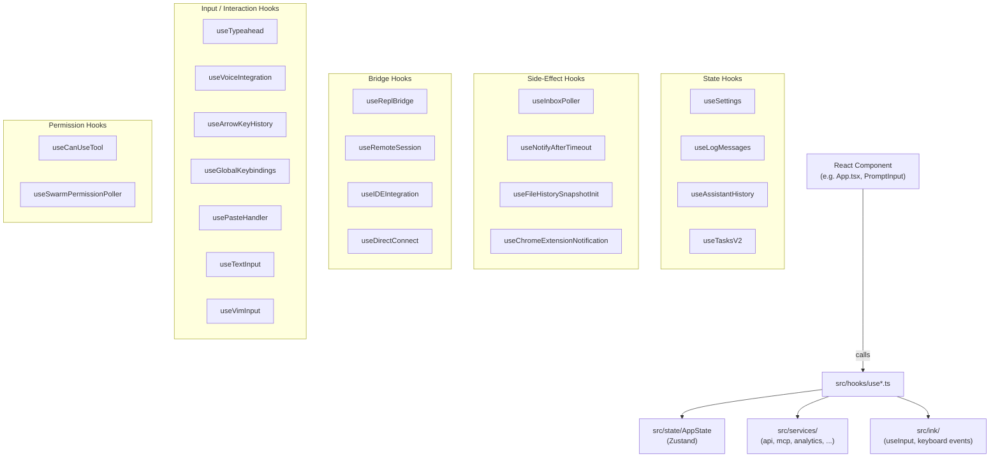

# Hook Ecosystem (React Hooks)

## 1. Purpose

`src/hooks/` contains 85+ React hooks across 104 files that encapsulate application-level state, side effects, and cross-cutting concerns for the Claude Code terminal UI. These are **React hooks** — they follow the `use*` naming convention, run inside React components, and are subject to React's rules of hooks. They are distinct from the user-configurable extensibility hooks in `src/utils/hooks/` (see `docs/architecture/user-hooks.md`).

## 2. Key Files

| File | Approx. size | Category |
|---|---|---|
| `src/hooks/useReplBridge.tsx` | 113 KB | Bridge hook — cloud session sync |
| `src/hooks/useTypeahead.tsx` | — | Input hook — autocomplete/suggestion engine |
| `src/hooks/useVoiceIntegration.tsx` | — | Voice hook — STT integration |
| `src/hooks/useGlobalKeybindings.tsx` | 30 KB | Keybinding hook — global shortcut handler |
| `src/hooks/useArrowKeyHistory.tsx` | 33 KB | Input hook — shell-style history navigation |
| `src/hooks/useCanUseTool.tsx` | 39 KB | Permission hook — tool authorization check |
| `src/hooks/useInboxPoller.ts` | 34 KB | Side-effect hook — background task polling |
| `src/hooks/useVirtualScroll.ts` | — | Scroll hook — virtual list scroll state |
| `src/hooks/useRemoteSession.ts` | 22 KB | Bridge hook — remote/collaborative session |
| `src/hooks/useLspPluginRecommendation.tsx` | 21 KB | Side-effect hook — LSP plugin suggestion |
| `src/hooks/useManagePlugins.ts` | 11 KB | State hook — plugin lifecycle |
| `src/hooks/useIDEIntegration.tsx` | 10 KB | Bridge hook — IDE connection |
| `src/hooks/fileSuggestions.ts` | 26 KB | Utility — background file index for typeahead |
| `src/hooks/notifs/` | — | Notification sub-hooks |
| `src/hooks/toolPermission/` | — | Tool permission sub-hooks |

## 3. Data Flow



## 4. Core Types

### useTypeahead

```ts
type Props = {
  onInputChange: (value: string) => void
  onSubmit: (value: string, isSubmittingSlashCommand?: boolean) => void
  setCursorOffset: (offset: number) => void
  input: string
  cursorOffset: number
  commands: Command[]
  mode: string
  agents: AgentDefinition[]
  setSuggestionsState: (f: (prev: SuggestionsState) => SuggestionsState) => void
  suggestionsState: SuggestionsState
}
type SuggestionsState = {
  suggestions: SuggestionItem[]
  selectedSuggestion: number
  commandArgumentHint?: string
}
```

### useReplBridge

```ts
function useReplBridge(
  messages: Message[],
  setMessages: (action: React.SetStateAction<Message[]>) => void,
  abortControllerRef: React.RefObject<AbortController | null>,
  commands: readonly Command[],
  mainLoopModel: string,
): { sendBridgeResult: () => void }
```

### useVoiceIntegration

```ts
type UseVoiceIntegrationArgs = {
  setInputValueRaw: React.Dispatch<React.SetStateAction<string>>
  inputValueRef: React.RefObject<string>
  insertTextRef: React.RefObject<InsertTextHandle | null>
}
type InsertTextHandle = {
  insert: (text: string) => void
  setInputWithCursor: (value: string, cursor: number) => void
  cursorOffset: number
}
```

## 5. Integration Points

- **Ink renderer** (`src/ink/`) — input hooks call `useInput` from the Ink package to subscribe to raw terminal keyboard events. `useGlobalKeybindings` and `useVoiceIntegration` use `KeyboardEvent` from `src/ink/events/keyboard-event.ts`.
- **App state** (`src/state/AppState.ts`) — most hooks read and write Zustand state via `useAppState`, `useSetAppState`, and `useAppStateStore`.
- **Services** (`src/services/`) — side-effect hooks call into `src/services/api/`, `src/services/mcp/`, `src/services/analytics/`, etc. Examples: `useReplBridge` initializes a bridge connection via `src/bridge/`; `useCanUseTool` invokes permission checks from `src/utils/permissions/`.
- **User-configurable hooks** (`src/utils/hooks/`) — `useDeferredHookMessages` bridges the two hook systems by surfacing deferred async hook output as React state updates.
- **Keybinding system** (`src/keybindings/`) — input hooks consume `useKeybindings` and `useOptionalKeybindingContext` to resolve user-configurable key assignments.
- **Context providers** — hooks consume `useNotifications` (notification context), `useIsModalOverlayActive` (overlay context), `useVoiceState` (voice context).

## 6. Design Decisions

**Hooks, not services, own React lifetime.** Logic that needs `useEffect`, `useRef`, or subscriptions to React state lives in `src/hooks/`, not in `src/services/`. Services expose plain async functions; hooks wire them into the component lifecycle.

**Bridge hooks are load-bearing and large.** `useReplBridge.tsx` (113 KB) manages WebSocket lifecycle, inbound message injection, failure backoff, and deduplication. Its size reflects the protocol complexity, not poor decomposition — the state machine needs to be co-located to correctly sequence connect, flush, teardown, and reconnect.

**Dead-code elimination via compile-time feature flags.** Several hooks (`useReplBridge`, `useVoiceIntegration`) guard optional features with `feature('BRIDGE_MODE')` / `feature('VOICE_MODE')` — Bun bundle-time constants that DCE unused code paths. The `require()` call in `useVoiceIntegration` is intentional: it allows `spyOn` in tests to intercept the module after load.

**Consecutive-failure fuse in `useReplBridge`.** The hook tracks `consecutiveFailuresRef` and stops retrying after `MAX_CONSECUTIVE_INIT_FAILURES = 3` to avoid generating hundreds of guaranteed-401 requests per day when OAuth is unrecoverable (observed in production Datadog data).

**Subdirectories for sub-hooks.** `src/hooks/notifs/` and `src/hooks/toolPermission/` each contain focused sub-hooks extracted from their parent to keep individual files manageable while keeping related code co-located.
