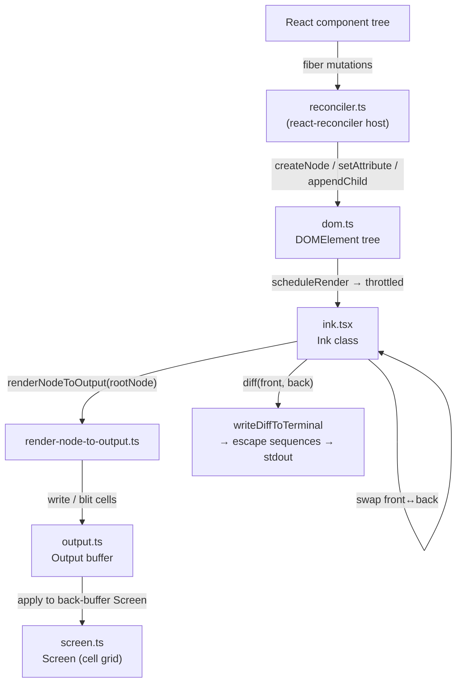

# Ink Renderer

## 1. Purpose

The Ink subsystem is a fully forked and heavily customized terminal renderer embedded directly in the codebase — it is **not** pulled from npm. It wraps a custom React reconciler over a Yoga-based layout engine to translate a React component tree into escape-sequence frames written to stdout. Every frame is double-buffered, diffed at the cell level, and flushed atomically using BSU/ESU sync-output mode when the terminal supports it.

## 2. Key Files

| File | Approx. size | Role |
|---|---|---|
| `src/ink/ink.tsx` | 246 KB | Core `Ink` class — owns the render loop, double-buffer, alt-screen, mouse/selection, and SIGCONT/resize handling |
| `src/ink/reconciler.ts` | 14 KB | Custom `react-reconciler` host config; maps React fiber operations to DOM mutations |
| `src/ink/render-node-to-output.ts` | 62 KB | Walk the virtual DOM tree and write cells into an `Output` buffer |
| `src/ink/output.ts` | 26 KB | `Output` class — collects write/blit/clip operations, applies them to a `Screen` |
| `src/ink/screen.ts` | 48 KB | `Screen` type plus `CharPool`, `StylePool`, `HyperlinkPool` interning; `writeDiffToTerminal` produces the escape sequence stream |
| `src/ink/dom.ts` | 15 KB | Virtual DOM types (`DOMElement`, `TextNode`) and mutation helpers |
| `src/ink/styles.ts` | 20 KB | Style struct and Yoga style application |
| `src/ink/selection.ts` | 34 KB | Text-selection state machine for alt-screen copy |
| `src/ink/log-update.ts` | 27 KB | Main-screen in-place update (cursor-relative rewrite, not full diff) |
| `src/ink/components/` | 18 files | Built-in Ink components (see below) |
| `src/ink/layout/` | 4 files | Yoga node wrappers (`engine.ts`, `yoga.ts`, `node.ts`, `geometry.ts`) |

### Custom Components (`src/ink/components/`)

`AlternateScreen`, `App`, `Box`, `Button`, `ErrorOverview`, `Link`, `Newline`, `NoSelect`, `RawAnsi`, `ScrollBox`, `Spacer`, `Text`, `ClockContext`, `AppContext`, `CursorDeclarationContext`, `StdinContext`, `TerminalFocusContext`, `TerminalSizeContext`

## 3. Data Flow



Key timing detail: `scheduleRender` is throttled to `FRAME_INTERVAL_MS` (roughly 16 ms). The diff only outputs changed cells, so steady-state frames with no changes produce zero bytes to stdout.

## 4. Core Types

```ts
// dom.ts — virtual DOM node
export type DOMElement = {
  nodeName: ElementNames            // 'ink-root' | 'ink-box' | 'ink-text' | ...
  attributes: Record<string, DOMNodeAttribute>
  childNodes: DOMNode[]
  textStyles?: TextStyles
  dirty: boolean
  isHidden?: boolean
  _eventHandlers?: Record<string, unknown>
  scrollTop?: number
  yogaNode?: LayoutNode
}

// screen.ts — interned character pool
export class CharPool {
  intern(char: string): number      // returns stable integer ID
  get(index: number): string
}
export class StylePool { /* similar interning for ANSI style bundles */ }
export class HyperlinkPool { /* OSC 8 hyperlink interning */ }

// ink.tsx — public Ink class options
export type Options = {
  stdout: NodeJS.WriteStream
  stdin:  NodeJS.ReadStream
  stderr: NodeJS.WriteStream
  exitOnCtrlC: boolean
  patchConsole: boolean
  waitUntilExit?: () => Promise<void>
  onFrame?: (event: FrameEvent) => void
}
```

## 5. Integration Points

- **React component tree** — all application components (`src/components/`) render through this reconciler. They import `Box`, `Text`, `ScrollBox`, etc. from `src/ink.js`.
- **Yoga layout engine** — `src/native-ts/yoga-layout/` (WASM). The reconciler calls `applyStyles` on every style update; `render-node-to-output.ts` reads computed layout coordinates.
- **`src/ink/hooks/`** — React hooks that live inside the Ink package (`useInput`, `useFocus`, `useStdout`, etc.) for keyboard and focus management.
- **`src/ink/events/`** — a capture/bubble `Dispatcher` routes keyboard events from raw terminal input to focused elements.
- **`src/ink/termio/`** — low-level terminal control sequences (CSI, DEC, OSC); used by `ink.tsx` directly to manage alt-screen, mouse tracking, and kitty keyboard protocol.
- **`FocusManager`** — `src/ink/focus.ts` tracks which element holds keyboard focus and is queried by the reconciler and event dispatcher.

## 6. Design Decisions

**Forked, not npm-installed.** The upstream Ink package was forked into the repo so that cell-level diffing, double-buffering, interned character pools, Kitty keyboard protocol, BIDI text, alt-screen selection, and search highlight could be added without being constrained by the npm package API surface.

**Double-buffered screen with interned pools.** `CharPool`, `StylePool`, and `HyperlinkPool` intern strings to stable integer IDs so the per-cell diff (`front[i] === back[i]`) is an integer comparison, not a string comparison. This cuts frame diff cost significantly for large screens.

**Throttled render loop, not continuous.** `scheduleRender` is a throttled closure (lodash `throttle`) rather than a `requestAnimationFrame` equivalent. Renders fire at most once per `FRAME_INTERVAL_MS`; React batches state updates between ticks normally.

**Sync-output (BSU/ESU) for tearing prevention.** When `SYNC_OUTPUT_SUPPORTED`, the renderer wraps each frame in begin/end synchronized output escape sequences so partial frames are never displayed.

**`onComputeLayout` / `onRender` callbacks on `DOMElement`.** Components that need to perform DOM-level work after layout (e.g., scroll position clamping) attach callbacks directly to their Yoga node without going through React state, avoiding extra reconciler cycles.
