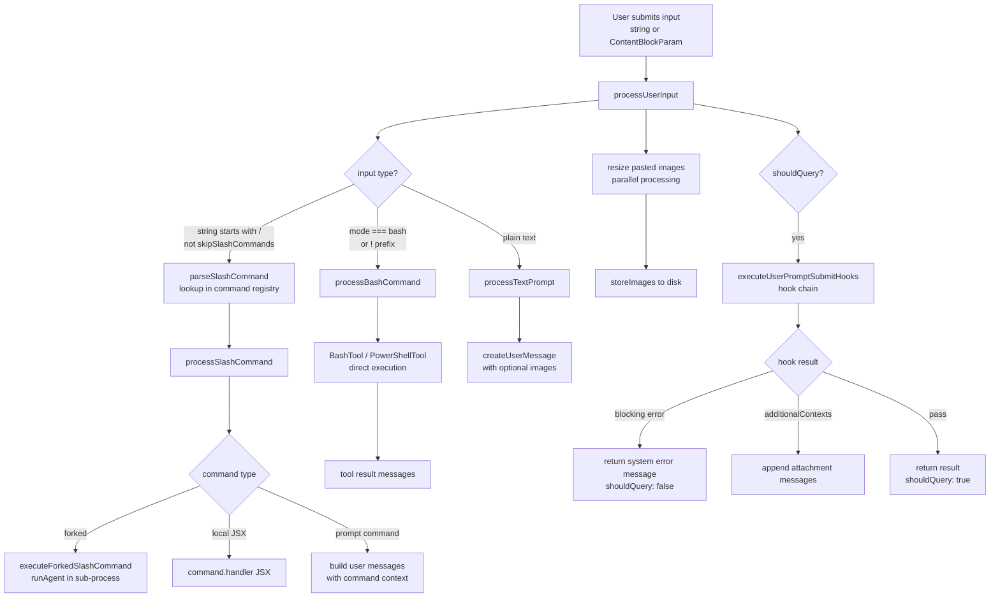

# Input Processing

## 1. Purpose

The input processing subsystem classifies every user submission and transforms it into the right set of messages before the query loop runs. It distinguishes slash commands, bare shell commands (the `!` prefix / bash mode), and plain text prompts, applies image resizing, runs `UserPromptSubmit` hooks, and assembles the final `Message[]` that drives the LLM turn.

## 2. Key Files

| File | Size | Role |
|------|------|------|
| `src/utils/processUserInput/processUserInput.ts` | 19 KB | Pipeline entry point; classification, image processing, hook execution |
| `src/utils/processUserInput/processSlashCommand.tsx` | 141 KB | Slash command lookup, forked agent execution, skill dispatch |
| `src/utils/processUserInput/processBashCommand.tsx` | 22 KB | Bash/PowerShell direct execution for `!cmd` input |
| `src/utils/processUserInput/processTextPrompt.ts` | 3 KB | Plain text and image paste → `UserMessage` |

## 3. Data Flow



### Classification Logic (inside `processUserInputBase`)

1. If `input` is an array of `ContentBlockParam`, extract the last text block as `inputString` and keep preceding blocks.
2. If `mode === 'bash'` or `inputString` starts with `!` (shell prefix), route to `processBashCommand`.
3. If `inputString` starts with `/` and `skipSlashCommands` is false, attempt slash command lookup via `parseSlashCommand` → `processSlashCommand`.
4. Otherwise, fall through to `processTextPrompt`.

## 4. Core Types

```typescript
// src/utils/processUserInput/processUserInput.ts
export type ProcessUserInputContext = ToolUseContext & LocalJSXCommandContext

export type ProcessUserInputBaseResult = {
  messages: (
    | UserMessage
    | AssistantMessage
    | AttachmentMessage
    | SystemMessage
    | ProgressMessage
  )[]
  shouldQuery: boolean
  allowedTools?: string[]
  model?: string
  effort?: EffortValue
  resultText?: string    // non-interactive output (forked commands)
  nextInput?: string     // chained input (e.g., /discover → feature command)
  submitNextInput?: boolean
}

// src/utils/processUserInput/processSlashCommand.tsx (internal)
type SlashCommandResult = ProcessUserInputBaseResult & {
  command: Command
}
```

## 5. Integration Points

| Connects To | Via |
|-------------|-----|
| Command registry | `src/commands.ts` — `findCommand`, `getCommandName`, `hasCommand` |
| BashTool | `src/tools/BashTool/BashTool.ts` — direct call in `processBashCommand` |
| PowerShellTool | Lazy-required when `resolveDefaultShell() === 'powershell'` |
| AgentTool | `src/tools/AgentTool/runAgent.ts` — forked slash commands spawn sub-agents |
| Hooks | `src/utils/hooks.ts` — `executeUserPromptSubmitHooks` wraps result |
| Image handling | `src/utils/imageResizer.ts`, `src/utils/imageStore.ts` — resize + persist |
| Analytics | `logEvent('tengu_input_bash')`, `logEvent('tengu_input_prompt')`, etc. |
| Bootstrap state | `setPromptId(randomUUID())` — stamps each turn with a unique prompt ID |
| Telemetry | `logOTelEvent('user_prompt', {...})` — emitted for every text prompt |

## 6. Design Decisions

- **Single entry point, three branches**: `processUserInput` is the only public function. All routing is internal, keeping callers (REPL, QueryEngine, bridge) uniform.
- **Hook chain wraps the whole result**: `UserPromptSubmit` hooks run after input classification but before the query loop. A blocking hook can veto the query entirely, returning a system error message. Non-blocking hooks can inject additional context as attachment messages.
- **Parallel image resizing**: Pasted images are resized with `Promise.all` before creating the `UserMessage`, so multiple images don't serialize I/O.
- **`skipSlashCommands` for bridge/remote inputs**: Messages arriving via the CCR bridge set `skipSlashCommands: true` so remotely-delivered `/` strings are treated as plain text. `bridgeOrigin: true` is a partial override allowing only bridge-safe commands to execute.
- **Forked slash commands as sub-agents**: Slash commands declared with `context: 'fork'` (e.g., skill commands like `/commit`) execute in a dedicated `AgentTool` sub-process rather than the main query loop, keeping the user session responsive.
- **Ultraplan keyword detection**: `hasUltraplanKeyword` is checked on `preExpansionInput` (before `[Pasted text #N]` expansion) to prevent pasted content from accidentally triggering the keyword.
- **PowerShell routing**: Shell selection follows the same `isPowerShellToolEnabled() && resolveDefaultShell() === 'powershell'` gate as `tools.ts` so the bash-mode input path matches the tool list exactly.
