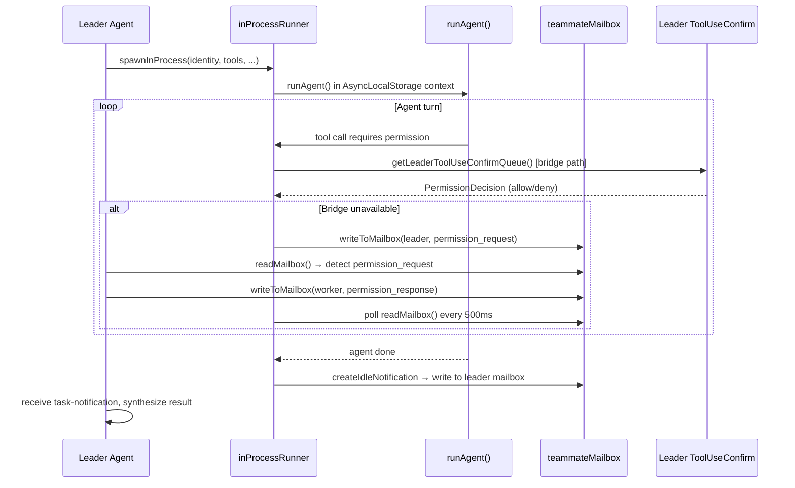
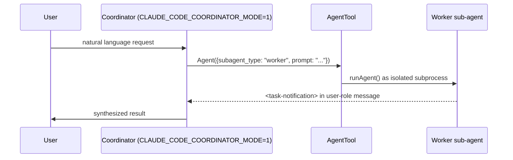

# Multi-Agent System

## 1. Purpose

Claude Code supports two distinct multi-agent paradigms: the **swarm** system (in-process teammates that run within the same CLI process and coordinate via a mailbox) and **coordinator mode** (a top-level orchestration persona that dispatches autonomous worker sub-agents via the `Agent` tool). The swarm system is implemented in `src/utils/swarm/` with team UI in `src/components/teams/`; coordinator mode is a prompt-layer configuration in `src/coordinator/`.

## 2. Key Files

### Swarm system (`src/utils/swarm/`)

| File | Size | Role |
|------|------|------|
| `inProcessRunner.ts` | 52.3 KB | Main teammate execution loop; wraps `runAgent()` |
| `It2SetupPrompt.tsx` | 41.7 KB | iTerm2 split-pane setup UI for teammate layout |
| `permissionSync.ts` | 25.9 KB | Mailbox-based permission request/response protocol |
| `teamHelpers.ts` | 20.9 KB | Team directory management and helper utilities |
| `spawnInProcess.ts` | 10.0 KB | Spawns teammates as in-process agents |
| `reconnection.ts` | 3.3 KB | Reconnection logic after teammate disconnect |
| `leaderPermissionBridge.ts` | 1.7 KB | Bridge from worker permission requests to leader's ToolUseConfirm queue |
| `teammateLayoutManager.ts` | 3.2 KB | Manages terminal pane layout for teammates |
| `teammateInit.ts` | 4.2 KB | Teammate initialization and identity setup |
| `constants.ts` | 1.3 KB | Shared constants (`TEAM_LEAD_NAME`, etc.) |

### Coordinator mode (`src/coordinator/`)

| File | Size | Role |
|------|------|------|
| `coordinatorMode.ts` | — | Mode detection, system prompt, user context |

## 3. Data Flow

### Swarm (in-process teammates)



### Coordinator mode (AgentTool workers)



## 4. Core Types

### Swarm types

```typescript
// src/tasks/InProcessTeammateTask/types.ts
export type TeammateIdentity = {
  agentId: string
  agentName: string
  agentColor?: string
  teamName: string
}

// src/utils/swarm/permissionSync.ts
export const SwarmPermissionRequestSchema = z.object({
  id: z.string(),
  workerId: z.string(),
  workerName: z.string(),
  workerColor: z.string().optional(),
  teamName: z.string(),
  toolName: z.string(),
  toolUseId: z.string(),
  description: z.string(),
  input: z.record(z.string(), z.unknown()),
  permissionSuggestions: z.array(z.unknown()),
  status: z.enum(['pending', 'approved', 'rejected']),
  resolvedBy: z.enum(['worker', 'leader']).optional(),
  feedback: z.string().optional(),
  updatedInput: z.record(z.string(), z.unknown()).optional(),
})
```

### Coordinator mode

```typescript
// src/coordinator/coordinatorMode.ts
export function isCoordinatorMode(): boolean
export function getCoordinatorSystemPrompt(): string
export function getCoordinatorUserContext(
  mcpClients: ReadonlyArray<{ name: string }>,
  scratchpadDir?: string,
): { [k: string]: string }
export function matchSessionMode(
  sessionMode: 'coordinator' | 'normal' | undefined,
): string | undefined
```

## 5. Integration Points

| Subsystem | How it connects |
|-----------|-----------------|
| **AgentTool** | `inProcessRunner` wraps `runAgent()` from `src/tools/AgentTool/runAgent.ts`; coordinator mode uses `AgentTool` directly to spawn workers |
| **Permission system** | `createInProcessCanUseTool` wraps `hasPermissionsToUseTool`; escalates to leader's ToolUseConfirm queue or mailbox when `behavior === 'ask'` |
| **AppState** | `inProcessRunner` calls `setAppState` to reflect teammate progress, compact events, and idle notifications in the leader's UI |
| **Mailbox** | `src/utils/teammateMailbox.ts` provides the filesystem-backed message bus for permission requests, idle notifications, and DM summaries |
| **Task framework** | `InProcessTeammateTask` in `src/tasks/` tracks teammate state for display; uses `appendTeammateMessage` and `appendCappedMessage` |
| **Teams UI** | `src/components/teams/` renders teammate status cards and the iTerm2 pane layout driven by `teammateLayoutManager.ts` |
| **Auto-compact** | `inProcessRunner` calls `compactConversation()` / `buildPostCompactMessages()` when context nears the threshold, then resets microcompact state |
| **Feature gate** | `COORDINATOR_MODE` bundle flag and `CLAUDE_CODE_COORDINATOR_MODE` env var both guard coordinator mode; `isCoordinatorMode()` checks both |

## 6. Design Decisions

**In-process isolation via AsyncLocalStorage.** Each teammate runs inside `runWithTeammateContext()` which uses Node's `AsyncLocalStorage` to isolate per-agent state (identity, color, team name) without subprocess overhead. This enables dozens of lightweight agents in one process.

**Two-path permission escalation.** The preferred path uses `getLeaderToolUseConfirmQueue()` to show the permission in the leader's existing `ToolUseConfirm` UI with a worker badge. The mailbox path is a fallback for headless or bridge-unavailable scenarios; it polls every 500 ms to avoid blocking the leader's event loop.

**Swarm vs. coordinator distinction.** Swarm teammates are in-process threads that share memory and the same terminal; they are designed for collaborative, fine-grained work where shared context is valuable. Coordinator mode spawns fully isolated subprocess workers via `AgentTool`; results arrive as structured `<task-notification>` XML in user-role messages, keeping the coordinator's context clean.

**Coordinator mode is prompt-layer only.** `isCoordinatorMode()` returns `true` when the `COORDINATOR_MODE` bundle flag is set and the env var is truthy. The system prompt and user context are injected at query time by `QueryEngine.ts`; no new runtime primitives are required.

**Scratchpad directory.** When the `tengu_scratch` gate is enabled and a `scratchpadDir` is provided, the coordinator context tells workers they can read and write to a shared directory without permission prompts. This gives long-running multi-worker tasks a durable knowledge store.

**Permission polling interval.** The mailbox poll interval is 500 ms (`PERMISSION_POLL_INTERVAL_MS`). This is a deliberate balance: short enough that workers feel responsive, long enough not to saturate the filesystem with lock acquisitions.
