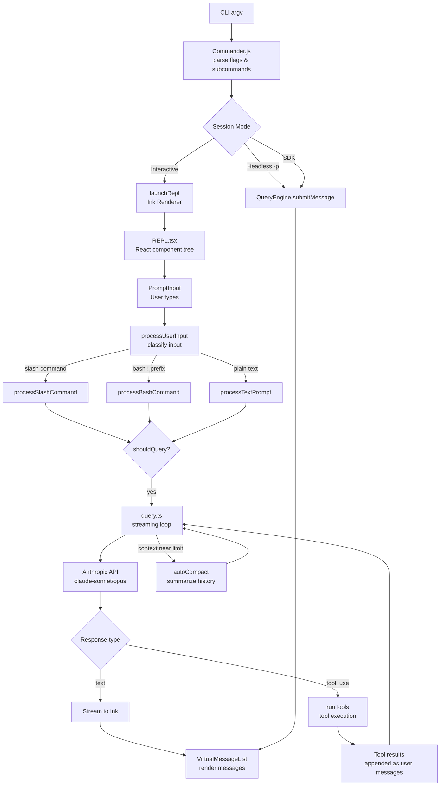
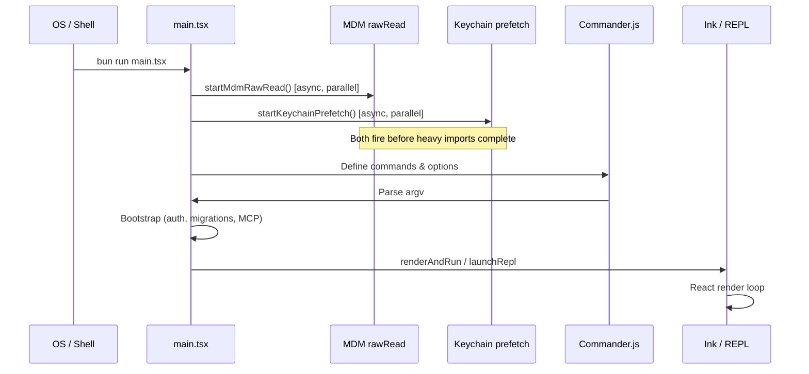

# Architecture Overview

## 1. Purpose

Claude Code is a terminal-based AI coding assistant that accepts natural language and command inputs, routes them through an LLM orchestration engine, executes tools on the local filesystem, and streams responses back to the user via a React/Ink-powered TUI. The system is built on Bun and TypeScript, supports multiple transport modes (interactive REPL, headless SDK, remote session), and integrates with the Anthropic API, MCP servers, and various platform services.

## 2. Key Files

| File | Size | Role |
|------|------|------|
| `src/main.tsx` | 785 KB | Entry point: CLI parsing, prefetch, bootstrap, Ink renderer launch |
| `src/QueryEngine.ts` | 45 KB | LLM turn orchestration for SDK/headless mode |
| `src/query.ts` | 67 KB | Core streaming query loop, tool execution, compaction |
| `src/screens/REPL.tsx` | ~large | Interactive REPL UI component (the largest file) |
| `src/Tool.ts` | 29 KB | Tool interface definitions and permission context |
| `src/state/AppStateStore.ts` | 21 KB | Central `AppState` type and store |
| `src/constants/prompts.ts` | ~large | System prompt construction functions |
| `src/commands.ts` | 25 KB | Slash command registry |

## 3. Data Flow

### Request Lifecycle



### Startup Sequence



## 4. Core Types

```typescript
// src/state/AppStateStore.ts
export type AppState = DeepImmutable<{
  settings: SettingsJson
  verbose: boolean
  mainLoopModel: ModelSetting
  toolPermissionContext: ToolPermissionContext
  // ... many more fields
}> & {
  tasks: { [taskId: string]: TaskState }
  mcp: { clients: MCPServerConnection[]; tools: Tool[]; commands: Command[]; resources: Record<string, ServerResource[]> }
  plugins: { enabled: LoadedPlugin[]; disabled: LoadedPlugin[]; errors: PluginError[]; needsRefresh: boolean }
}

// src/QueryEngine.ts
export type QueryEngineConfig = {
  cwd: string
  tools: Tools
  commands: Command[]
  mcpClients: MCPServerConnection[]
  agents: AgentDefinition[]
  canUseTool: CanUseToolFn
  getAppState: () => AppState
  setAppState: (f: (prev: AppState) => AppState) => void
  initialMessages?: Message[]
  readFileCache: FileStateCache
  customSystemPrompt?: string
  userSpecifiedModel?: string
  maxTurns?: number
  maxBudgetUsd?: number
}

// src/query.ts
export type QueryParams = {
  messages: Message[]
  systemPrompt: SystemPrompt
  userContext: { [k: string]: string }
  systemContext: { [k: string]: string }
  canUseTool: CanUseToolFn
  toolUseContext: ToolUseContext
  fallbackModel?: string
  querySource: QuerySource
  maxTurns?: number
  taskBudget?: { total: number }
}
```

## 5. Integration Points

| Subsystem | How Connected |
|-----------|---------------|
| Anthropic SDK | `src/services/api/claude.ts` — builds requests, handles streaming |
| MCP Servers | `src/services/mcp/client.ts` — connects, discovers tools/resources |
| Commander.js | `main.tsx` — defines all CLI flags and subcommands |
| React + Ink | `src/screens/REPL.tsx` — full TUI rendered by custom Ink fork |
| OpenTelemetry | Lazy-loaded on demand; `src/utils/telemetry/` |
| GrowthBook | Feature flags via `src/services/analytics/growthbook.ts` |
| Bun `feature()` | Dead-code elimination for feature-gated modules at bundle time |
| Keychain / MDM | Prefetched in parallel at startup before module graph loads |

## 6. Design Decisions

- **Parallel prefetch at startup**: MDM reads and keychain lookups are fired as the very first two side-effects in `main.tsx`, before the remaining ~135ms of imports complete. This overlaps I/O latency with module loading.
- **Bun `feature()` for dead code elimination**: Feature-gated modules (`COORDINATOR_MODE`, `VOICE_MODE`, `KAIROS`, etc.) use `feature('FLAG') ? require(...)  : null` so bundled builds strip unused code paths entirely.
- **Dual execution paths**: `QueryEngine` owns headless/SDK turns; the interactive REPL drives `query.ts` directly. Both paths converge at the same `query.ts` streaming loop and tool orchestration layer.
- **React compiler output**: `REPL.tsx` and `AppState.tsx` show React compiler-generated cache slots (`_c(N)`) indicating the codebase uses the React compiler for automatic memoization.
- **Lazy React/Ink imports**: Heavy UI modules (e.g., `MessageSelector.tsx`) are lazy-required inside `QueryEngine.ts` to avoid pulling React into the headless path.

## Tech Stack

| Technology | Version / Notes | Role |
|------------|----------------|------|
| Bun | Runtime + bundler | JS runtime, `feature()` DCE, fast startup |
| TypeScript | Strict mode | Primary language |
| React + Ink | Custom fork | Terminal UI rendering |
| Commander.js | `@commander-js/extra-typings` | CLI argument parsing |
| Zod v4 | Schema validation | Tool inputs, settings |
| ripgrep | System binary | Fast file search (GrepTool) |
| MCP SDK | `@modelcontextprotocol/sdk` | MCP server connections |
| Anthropic SDK | `@anthropic-ai/sdk` | API client |
| OpenTelemetry | Lazy-loaded | Tracing and metrics |
| GrowthBook | Feature flags | A/B testing, kill switches |
