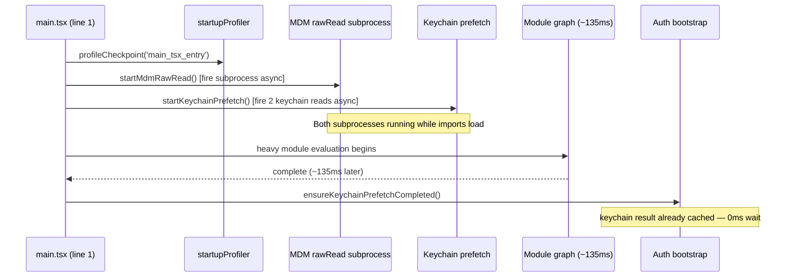
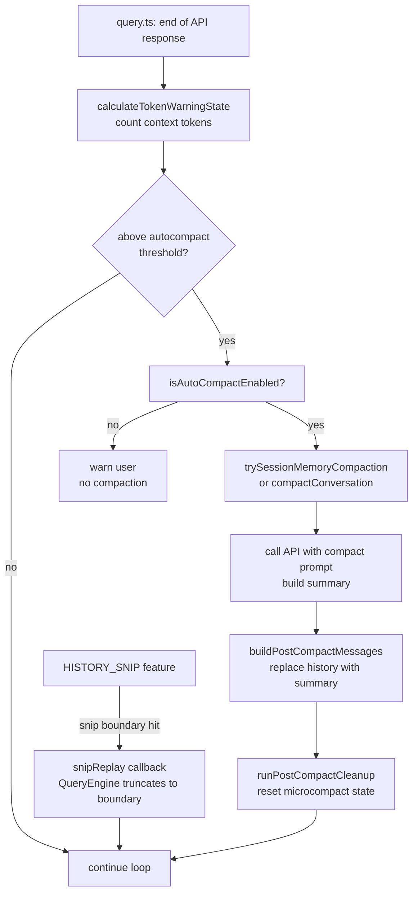
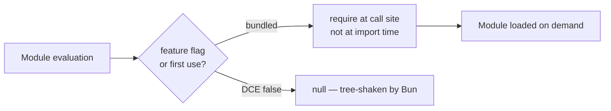

# Performance

## 1. Purpose

Claude Code applies several performance strategies to minimize perceived latency: parallel I/O prefetching at startup, lazy loading of heavyweight modules, streaming API responses, and automatic context compression to keep long sessions within the model's context window. These strategies span startup time, runtime throughput, and memory management.

## 2. Key Files

| File | Size | Role |
|------|------|------|
| `src/main.tsx` | 785 KB | Parallel prefetch side-effects fired at import time |
| `src/utils/startupProfiler.ts` | small | `profileCheckpoint` for startup timing |
| `src/utils/secureStorage/keychainPrefetch.ts` | small | macOS keychain parallel read |
| `src/utils/settings/mdm/rawRead.ts` | small | MDM subprocess parallel fire |
| `src/services/compact/autoCompact.ts` | 13 KB | Auto-compaction trigger logic and thresholds |
| `src/services/compact/compact.ts` | 59 KB | Conversation summarization engine |
| `src/services/compact/microCompact.ts` | 19 KB | Micro-compaction (cached mid-conversation summaries) |
| `src/services/compact/snipCompact.ts` | gated | Snip-boundary compaction (HISTORY_SNIP feature) |
| `src/services/compact/sessionMemoryCompact.ts` | 20 KB | Session memory persistence across compactions |
| `src/utils/headlessProfiler.ts` | small | `headlessProfilerCheckpoint` for SDK path timing |
| `src/utils/queryProfiler.ts` | small | `queryCheckpoint` for per-turn profiling |

## 3. Data Flow

### Startup Parallel Prefetch



### Auto-Compaction Flow



### Lazy Loading Pattern



## 4. Core Types

```typescript
// src/services/compact/autoCompact.ts
export type AutoCompactTrackingState = {
  compacted: boolean
  turnCounter: number
  turnId: string            // unique per turn
  consecutiveFailures?: number  // circuit-breaker for irrecoverable contexts
}

// Threshold constants (autoCompact.ts)
export const AUTOCOMPACT_BUFFER_TOKENS = 13_000
export const WARNING_THRESHOLD_BUFFER_TOKENS = 20_000
export const ERROR_THRESHOLD_BUFFER_TOKENS = 20_000
export const MANUAL_COMPACT_BUFFER_TOKENS = 3_000
const MAX_CONSECUTIVE_AUTOCOMPACT_FAILURES = 3  // circuit breaker

// src/services/compact/autoCompact.ts
export function getEffectiveContextWindowSize(model: string): number
// Returns contextWindow - min(maxOutputTokens, 20_000)
// Reserves output tokens so the summary response has room to complete

export function getAutoCompactThreshold(model: string): number
// Returns effectiveContextWindow - AUTOCOMPACT_BUFFER_TOKENS
// Overridable via CLAUDE_AUTOCOMPACT_PCT_OVERRIDE env var
```

## 5. Integration Points

| Technique | Where Applied | Details |
|-----------|---------------|---------|
| Parallel prefetch | `main.tsx` top of file | MDM and keychain reads fire before any other import executes |
| Lazy require | `QueryEngine.ts`, `query.ts`, `prompts.ts`, `REPL.tsx` | `feature('X') ? require(...) : null` pattern for gated modules |
| Streaming responses | `query.ts` streaming loop | Anthropic SDK streams events; Ink renders incrementally |
| Auto-compaction | `query.ts` → `autoCompact.ts` | Triggered when context token count crosses `getAutoCompactThreshold()` |
| Micro-compaction | `services/compact/microCompact.ts` | Caches partial summaries mid-conversation for fast re-entry |
| Snip compaction | `services/compact/snipCompact.ts` (HISTORY_SNIP) | SDK mode truncates at snip boundaries; REPL uses projection |
| Session memory | `services/compact/sessionMemoryCompact.ts` | Persists semantic memory across full compactions |
| Token budget | `query/tokenBudget.ts` + `bootstrap/state.ts` | Per-turn budget tracking; auto-continue when model hits output limit |
| Profile checkpoints | `startupProfiler`, `headlessProfiler`, `queryProfiler` | Named timing points for perf regression detection |

## 6. Design Decisions

- **Prefetch before imports**: MDM and keychain reads are the first two statements in `main.tsx`, placed before any `import` that could trigger module evaluation. The comment in source is explicit: "so they run in parallel with the remaining ~135ms of imports below." On macOS, the keychain sync spawn costs ~65ms — prefetching eliminates this from the critical path.

- **`feature()` for dead-code elimination**: Bun's `feature()` built-in is a compile-time constant. Calls like `feature('VOICE_MODE') ? require('./context/voice.js') : null` are evaluated at bundle time; the `null` branch is stripped entirely from external builds, keeping bundle size minimal.

- **Streaming incremental render**: The `query.ts` loop yields `StreamEvent` messages as they arrive from the API. Ink re-renders only the changed portion of the component tree on each event, giving users immediate visual feedback as the model generates text.

- **Auto-compaction circuit breaker**: `consecutiveFailures` in `AutoCompactTrackingState` stops retrying after `MAX_CONSECUTIVE_AUTOCOMPACT_FAILURES = 3`. Before this, sessions with irrecoverably large contexts would waste ~250K API calls/day globally in retry loops.

- **Effective context window reservation**: `getEffectiveContextWindowSize` subtracts `min(maxOutputTokens, 20_000)` from the model's context window before computing the compaction threshold. This ensures the summary response (observed p99.99 of 17,387 tokens) always has room to complete.

- **Snip projection for REPL**: Interactive sessions keep the full message history for scroll-back. When a snip boundary is reached, `snipProjection` computes a truncated view for the API call without discarding history from the UI. SDK/headless sessions truncate for real to bound memory in long runs.

- **Token budget auto-continue**: When the model reaches its per-response output limit mid-generation, `query.ts` detects `max_output_tokens` and automatically continues the request (up to `MAX_OUTPUT_TOKENS_RECOVERY_LIMIT = 3` times), transparently stitching the output together before yielding to callers.
