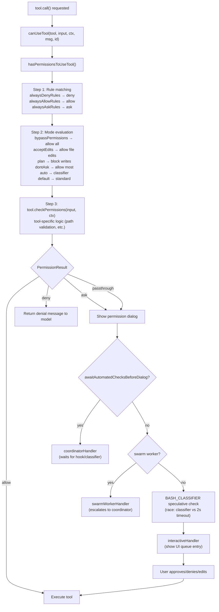

# Permission System

## 1. Purpose

The permission system decides whether Claude is allowed to execute a given tool call. Every tool invocation passes through a permission check that evaluates the current mode, configured allow/deny/ask rules, tool-specific logic, and optional classifier or hook overrides before either proceeding, prompting the user, or rejecting the call. The system is designed to be fail-safe: unknown situations default to asking the user.

## 2. Key Files

| File | Size | Role |
|---|---|---|
| `src/types/permissions.ts` | ~442 lines | All permission type definitions: modes, rules, decisions, results, classifier types |
| `src/hooks/useCanUseTool.tsx` | ~200 lines | React hook wiring the permission decision flow for the interactive REPL |
| `src/utils/permissions/permissions.ts` | — | `hasPermissionsToUseTool()`: evaluates rules, mode, and tool-specific `checkPermissions()` |
| `src/utils/permissions/PermissionResult.ts` | — | `PermissionDecision` re-export and helpers |
| `src/hooks/toolPermission/handlers/` | — | Separate handlers: `interactiveHandler`, `coordinatorHandler`, `swarmWorkerHandler` |
| `src/hooks/toolPermission/PermissionContext.ts` | — | `createPermissionContext()`, `createPermissionQueueOps()` |
| `src/utils/permissions/denialTracking.ts` | — | `DenialTrackingState`: escalates repeated denials to prompts for async agents |

## 3. Data Flow



## 4. Core Types

```typescript
// src/types/permissions.ts

// Five external + two internal modes
export type PermissionMode =
  | 'acceptEdits'       // Auto-approve file edits, ask for shell
  | 'bypassPermissions' // Allow everything (requires explicit opt-in)
  | 'default'           // Standard interactive mode
  | 'dontAsk'           // Approve most actions without prompting
  | 'plan'              // Read-only; writes blocked
  | 'auto'              // TRANSCRIPT_CLASSIFIER flag: classifier decides
  | 'bubble'            // Internal: propagate to parent agent

// Where a rule was configured
export type PermissionRuleSource =
  | 'userSettings'    // ~/.claude/settings.json
  | 'projectSettings' // .claude/settings.json (project root)
  | 'localSettings'   // .claude/settings.local.json
  | 'flagSettings'    // Statsig/GrowthBook remote config
  | 'policySettings'  // Org-level policy enforcement
  | 'cliArg'          // --allowedTools / --disallowedTools flags
  | 'command'         // /permissions command (runtime)
  | 'session'         // In-session user grant (ephemeral)

export type PermissionRule = {
  source: PermissionRuleSource
  ruleBehavior: 'allow' | 'deny' | 'ask'
  ruleValue: {
    toolName: string
    ruleContent?: string  // e.g., "git *" for Bash(git *)
  }
}

// Three decision outcomes (+ passthrough for escalation)
export type PermissionResult<Input = Record<string, unknown>> =
  | { behavior: 'allow'; updatedInput?: Input; decisionReason?: PermissionDecisionReason; ... }
  | { behavior: 'ask'; message: string; suggestions?: PermissionUpdate[]; pendingClassifierCheck?: PendingClassifierCheck; ... }
  | { behavior: 'deny'; message: string; decisionReason: PermissionDecisionReason; ... }
  | { behavior: 'passthrough'; message: string; ... }

// Typed explanation of why a decision was made
export type PermissionDecisionReason =
  | { type: 'rule'; rule: PermissionRule }
  | { type: 'mode'; mode: PermissionMode }
  | { type: 'classifier'; classifier: string; reason: string }
  | { type: 'hook'; hookName: string; hookSource?: string; reason?: string }
  | { type: 'asyncAgent'; reason: string }
  | { type: 'workingDir'; reason: string }
  | { type: 'safetyCheck'; reason: string; classifierApprovable: boolean }
  | { type: 'sandboxOverride'; reason: 'excludedCommand' | 'dangerouslyDisableSandbox' }
  | { type: 'subcommandResults'; reasons: Map<string, PermissionResult> }
  | { type: 'other'; reason: string }

// Immutable permission context threaded through all tool calls
export type ToolPermissionContext = DeepImmutable<{
  mode: PermissionMode
  additionalWorkingDirectories: Map<string, AdditionalWorkingDirectory>
  alwaysAllowRules: ToolPermissionRulesBySource  // { [source]: string[] }
  alwaysDenyRules: ToolPermissionRulesBySource
  alwaysAskRules: ToolPermissionRulesBySource
  isBypassPermissionsModeAvailable: boolean
  shouldAvoidPermissionPrompts?: boolean    // async agents without UI
  awaitAutomatedChecksBeforeDialog?: boolean // coordinator workers
  prePlanMode?: PermissionMode              // saved mode before plan entry
}>
```

### `useCanUseTool` hook signature

```typescript
export type CanUseToolFn<Input = Record<string, unknown>> = (
  tool: Tool,
  input: Input,
  toolUseContext: ToolUseContext,
  assistantMessage: AssistantMessage,
  toolUseID: string,
  forceDecision?: PermissionDecision<Input>,
) => Promise<PermissionDecision<Input>>
```

## 5. Integration Points

- **Tool system**: Every tool in `Tool.ts` has a `checkPermissions(input, context)` method. `buildTool` defaults this to `{ behavior: 'allow' }`, delegating entirely to the global system. Security-sensitive tools (e.g., `BashTool`) override it with path and command validation.
- **AppState**: `ToolPermissionContext` lives in `AppState.toolPermissionContext` and is updated by the `/permissions` command and session-level grants. It is threaded through `ToolUseContext` to every tool call.
- **Classifier (TRANSCRIPT_CLASSIFIER / BASH_CLASSIFIER)**: When `auto` mode is active or `pendingClassifierCheck` is set, the `useCanUseTool` hook races a speculative classifier promise against a 2-second timeout. High-confidence allow results short-circuit the UI queue.
- **Coordinator/Swarm**: `awaitAutomatedChecksBeforeDialog` causes the coordinator handler to wait for hook/classifier results before showing the dialog. Swarm worker agents escalate `ask` results to their coordinator via `handleSwarmWorkerPermission`.
- **Hooks**: Pre-tool and post-tool hooks can override permission decisions by returning `approve`/`reject` responses. The `PermissionDecisionReason` records the hook name and source for audit.
- **Denial tracking**: `DenialTrackingState` in `ToolUseContext.localDenialTracking` accumulates denials for async agents (whose `setAppState` is a no-op) and escalates to prompting after a threshold.

## 6. Design Decisions

- **Centralized types, distributed implementation**: `src/types/permissions.ts` holds only pure type definitions to break import cycles. Runtime logic lives in `src/utils/permissions/`. This allows tools, hooks, and UI components to import types without pulling in implementation dependencies.
- **`passthrough` as escalation**: The fourth behavior value (`passthrough`) means "I don't know — ask someone higher." It carries its own `message` and `suggestions` so the escalation path has context.
- **`PermissionDecisionReason` as audit trail**: Every non-trivial decision includes a structured reason that is logged to analytics, shown in the UI, and serialized to transcripts. This makes permission behavior observable and debuggable.
- **Rule sources encode trust level**: `policySettings` and `flagSettings` represent org-level or Anthropic-pushed rules and cannot be overridden by user or project settings at the UI level. `session` rules are ephemeral and vanish when the session ends.
- **`shouldAvoidPermissionPrompts`**: Background agents that run without a terminal (e.g., cron-triggered agents) set this flag. The permission system auto-denies rather than hanging waiting for input.
