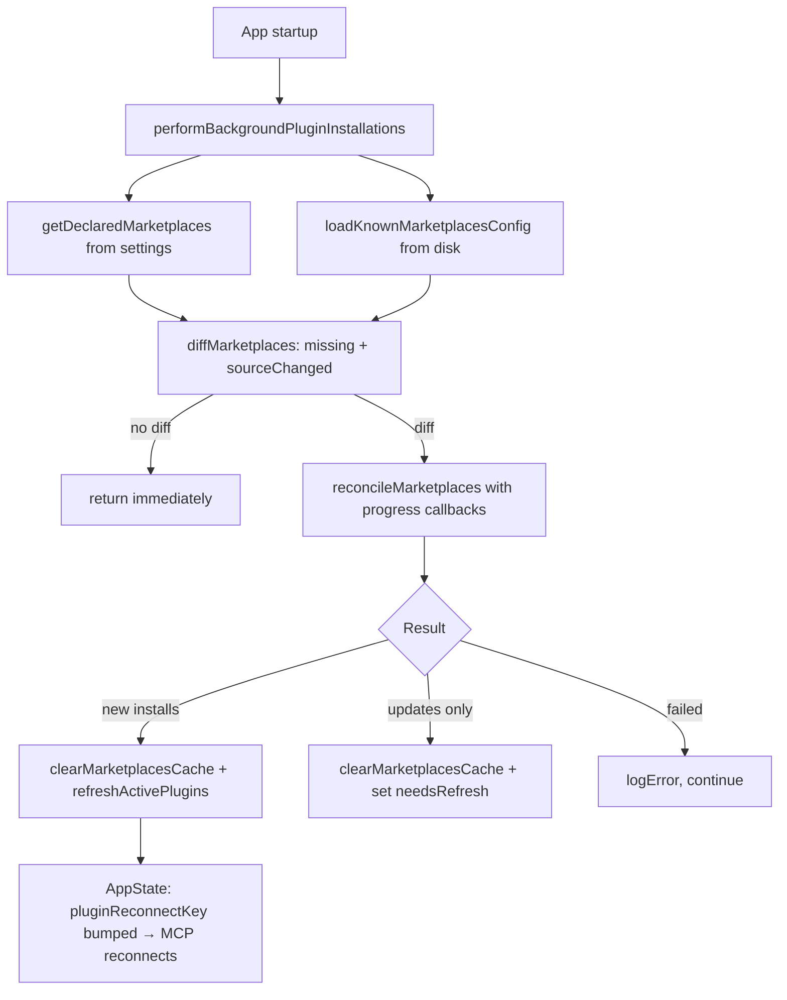

# Plugin System

## 1. Purpose

The plugin system lets users extend Claude Code with third-party capabilities sourced from marketplace repositories. Plugins can contribute skills (slash commands), hooks, MCP servers, and LSP servers. The system handles the full plugin lifecycle: discovery from marketplace git repos, installation, enable/disable per scope, version management, background reconciliation, and hot-reload without restart.

## 2. Key Files

| File | Size | Role |
|------|------|------|
| `src/services/plugins/pluginOperations.ts` | 34.8 KB | Core install/uninstall/enable/disable/update operations (pure library, no side effects) |
| `src/services/plugins/pluginCliCommands.ts` | 10.6 KB | Thin CLI wrappers: console output, process exit, telemetry |
| `src/services/plugins/PluginInstallationManager.ts` | 5.9 KB | Background marketplace reconciliation; maps progress events to AppState |
| `src/utils/plugins/marketplaceManager.ts` | — | Marketplace config loading, git-clone, cache management |
| `src/utils/plugins/pluginLoader.ts` | — | Plugin manifest parsing, versioned cache, `loadAllPlugins` |
| `src/utils/plugins/reconciler.ts` | — | `reconcileMarketplaces`: diff declared vs materialized, install/update |
| `src/utils/plugins/refresh.ts` | — | `refreshActivePlugins`: clear caches, reload, bump MCP reconnect key |
| `src/utils/plugins/pluginInstallationHelpers.ts` | — | `installResolvedPlugin`: copy to versioned cache, write installed_plugins.json |
| `src/types/plugin.ts` | — | `PluginManifest`, `LoadedPlugin` types |

## 3. Data Flow

### Installation

```mermaid
flowchart TD
    A[claude plugin install &lt;id&gt;@&lt;marketplace&gt;] --> B[parsePluginIdentifier]
    B --> C[getMarketplace: load/clone marketplace git repo]
    C --> D[getPluginById: find plugin in marketplace manifest]
    D --> E{Policy check}
    E -->|blocked| F[error: policy blocked]
    E -->|allowed| G[installResolvedPlugin]
    G --> H[copyPluginToVersionedCache]
    H --> I[updateSettingsForSource: enabledPlugins\[id\] = true]
    I --> J[/reload-plugins or auto-refresh/]
```

### Background startup reconciliation



### Scope resolution (install vs enable)

Settings are checked at three scopes with `local > project > user` precedence. A plugin can be *installed* at one scope (entry in `installed_plugins.json`) and *enabled/disabled* at another scope (entry in `settings.json`'s `enabledPlugins`). `isPluginEnabledAtProjectScope` is a separate check used by the uninstall UI to warn about orphaned enablements.

## 4. Core Types

```typescript
// src/types/plugin.ts
export type PluginManifest = {
  id: string
  name: string
  version: string
  description: string
  skills?: string[]       // paths to skill .md files
  hooks?: HooksSettings
  mcpServers?: Record<string, MCPServerConfig>
  lspServers?: unknown[]
  dependencies?: string[] // other plugin IDs
}

export type LoadedPlugin = {
  manifest: PluginManifest
  pluginDir: string
  scope: PluginScope
  source: SettingSource
}

// src/utils/plugins/schemas.ts
export type PluginScope = 'user' | 'project' | 'local' | 'managed'

// src/services/plugins/pluginOperations.ts
export type PluginOperationResult = {
  success: boolean
  message: string
  pluginId?: string
  pluginName?: string
  scope?: PluginScope
  reverseDependents?: string[]  // plugins that depend on this one
}

export type PluginUpdateResult = {
  success: boolean
  message: string
  pluginId?: string
  newVersion?: string
  oldVersion?: string
  alreadyUpToDate?: boolean
  scope?: PluginScope
}

export type InstallableScope = 'user' | 'project' | 'local'
```

## 5. Integration Points

| Subsystem | How it connects |
|-----------|-----------------|
| **Skill system** | Plugins contribute skills via `manifest.skills`; loaded by `loadSkillsDir.ts` from the plugin's versioned cache directory at startup or `/reload-plugins` |
| **MCP client** | `manifest.mcpServers` entries are merged into the MCP config; `pluginReconnectKey` in AppState signals the MCP layer to re-establish connections after a reload |
| **Settings system** | `enabledPlugins` map in `settings.json` at each scope governs enable/disable; `updateSettingsForSource` writes changes atomically |
| **AppState** | `plugins.installationStatus` tracks marketplace/plugin install progress for UI display; `plugins.needsRefresh` triggers the `/reload-plugins` notification |
| **CLI commands** | `pluginCliCommands.ts` wraps operations for `claude plugin install|uninstall|enable|disable|update`; `pluginOperations.ts` is also used by the interactive ManagePlugins UI |
| **Policy** | `isPluginBlockedByPolicy` in `pluginPolicy.ts` allows managed-settings administrators to block specific plugins by ID |
| **Analytics** | `tengu_marketplace_background_install` event with install/update/fail counts; `tengu_plugin_command_failed` on CLI errors |

## 6. Design Decisions

**Separation of operations from CLI concerns.** `pluginOperations.ts` is documented as a pure library: no `process.exit()`, no `console` writes. `pluginCliCommands.ts` is the thin adapter that adds those. This allows the same operations to be called from both the CLI and the interactive ManagePlugins React UI without code duplication.

**Versioned cache.** Each installed plugin version is stored at a deterministic path via `getVersionedCachePath(id, version)`. This allows atomic updates: the new version is written to a fresh path, then `installed_plugins.json` is updated to point to it. A rollback is just reverting the pointer.

**Marketplace as a git repository.** Marketplaces are git repos cloned to a local cache directory. `reconcileMarketplaces` diffs the declared URL/ref against what is on disk. This gives reproducible installs and the ability to pin plugins to a specific commit.

**Dependency resolution and reverse-dependent warnings.** `findReverseDependents` scans installed plugins for dependency declarations before uninstalling or disabling a plugin. The warning is informational — the operation is not blocked — but surfaces the risk of breaking dependent plugins.

**Background install, auto-refresh on new marketplace.** A newly added marketplace is installed in the background (non-blocking startup). If it is genuinely new (not just updated), `refreshActivePlugins` is called automatically so the user's next prompt can use the new plugins immediately. Updates are deliberately deferred to a user-triggered `/reload-plugins` to avoid mid-session disruption.

**Scope precedence for install vs enable.** The `local > project > user` precedence mirrors the settings hierarchy used elsewhere in Claude Code. Managed-settings plugins (`managed` scope) can only be installed by administrators and cannot be uninstalled by users, but can be updated.
