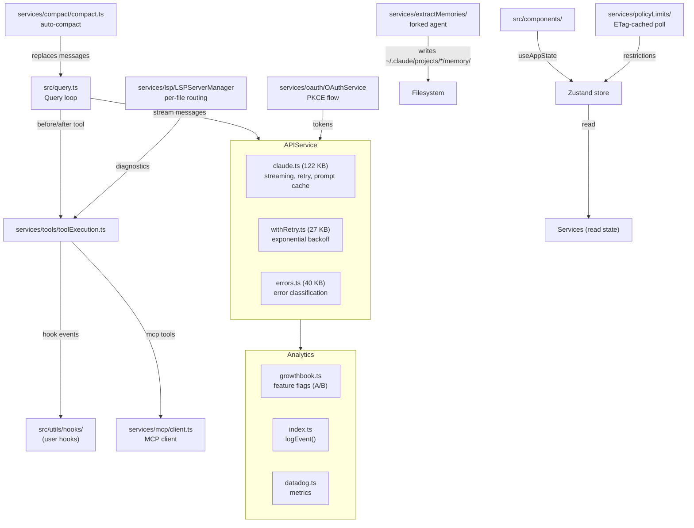

# Service Layer

## 1. Purpose

`src/services/` houses the backend logic that communicates with external systems and performs expensive operations that are too complex to live in components or hooks. Services expose plain (non-React) functions and classes, are initialized once at startup or on demand, and are called from the query loop, tool executor, and React hooks. They cover API communication, MCP protocol, authentication, analytics, context compaction, LSP, plugins, policy enforcement, and memory extraction.

## 2. Key Files

### Subdirectory overview (20 directories + 16 top-level files)

| Directory | Files | Role |
|---|---|---|
| `api/` | 20 | Anthropic API client, retry logic, streaming, error handling |
| `mcp/` | 20 | MCP client, connection manager, transport, tool/resource dispatch |
| `oauth/` | 5 | OAuth 2.0 PKCE flow, token refresh, profile fetch |
| `analytics/` | 9 | GrowthBook feature flags, event logging, Datadog, 1P exporter |
| `compact/` | 11 | Conversation compaction (auto, micro, session-memory, API-micro) |
| `lsp/` | 7 | Language Server Protocol client, server manager, diagnostics |
| `plugins/` | 3 | Plugin install, operations, CLI commands |
| `policyLimits/` | 2 | Org-level policy restrictions, ETag-cached polling |
| `remoteManagedSettings/` | 5 | Remote settings sync, security check, cache |
| `extractMemories/` | 2 | End-of-query auto-memory extraction via forked agent |
| `tools/` | 4 | Tool execution, hooks, streaming executor, orchestration |
| `settingsSync/` | 2 | Settings synchronization |
| `AgentSummary/` | — | Agent summary generation |
| `autoDream/` | — | Auto-dream feature |
| `MagicDocs/` | — | Magic docs integration |
| `PromptSuggestion/` | — | Prompt suggestion logic |
| `SessionMemory/` | — | Session memory management |
| `teamMemorySync/` | — | Team memory synchronization |
| `tips/` | — | Tips/hints service |
| `toolUseSummary/` | — | Tool usage summary |

### Top-level service files

| File | Approx. size | Role |
|---|---|---|
| `src/services/voice.ts` | 16.7 KB | Voice input (STT) service |
| `src/services/voiceStreamSTT.ts` | 20.9 KB | Streaming speech-to-text |
| `src/services/tokenEstimation.ts` | 16.5 KB | Token counting estimation |
| `src/services/claudeAiLimits.ts` | 16.4 KB | Claude.ai rate limit tracking |
| `src/services/diagnosticTracking.ts` | 12.3 KB | Diagnostic event tracking |
| `src/services/rateLimitMessages.ts` | 10.6 KB | Rate limit error messaging |
| `src/services/vcr.ts` | 11.9 KB | API response recording/replay |
| `src/services/notifier.ts` | 4.2 KB | System notification dispatch |
| `src/services/preventSleep.ts` | 4.5 KB | OS sleep prevention during long operations |

## 3. Data Flow



## 4. Core Types

### API service (`services/api/claude.ts`)

```ts
// Uses @anthropic-ai/sdk BetaMessage types throughout
import type {
  BetaMessage,
  BetaRawMessageStreamEvent,
  BetaMessageStreamParams,
} from '@anthropic-ai/sdk/resources/beta/messages/messages.mjs'
```

### MCP client (`services/mcp/client.ts`)

```ts
// Wraps @modelcontextprotocol/sdk
import { Client } from '@modelcontextprotocol/sdk/client/index.js'
// Transports: stdio, SSE, StreamableHTTP
import { StdioClientTransport } from '@modelcontextprotocol/sdk/client/stdio.js'
import { SSEClientTransport } from '@modelcontextprotocol/sdk/client/sse.js'
import { StreamableHTTPClientTransport } from '@modelcontextprotocol/sdk/client/streamableHttp.js'
```

### OAuth service (`services/oauth/index.ts`)

```ts
export class OAuthService {
  async startOAuthFlow(
    authURLHandler: (url: string, automaticUrl?: string) => Promise<void>,
    options?: {
      loginWithClaudeAi?: boolean
      inferenceOnly?: boolean
      expiresIn?: number
      orgUUID?: string
      loginHint?: string
      loginMethod?: string
    }
  ): Promise<OAuthTokens>
}
```

### GrowthBook analytics (`services/analytics/growthbook.ts`)

```ts
export type GrowthBookUserAttributes = {
  id: string
  sessionId: string
  deviceID: string
  platform: 'win32' | 'darwin' | 'linux'
  apiBaseUrlHost?: string
  organizationUUID?: string
  accountUUID?: string
  userType?: string
  subscriptionType?: string
  rateLimitTier?: string
  firstTokenTime?: number
  email?: string
  appVersion?: string
  github?: GitHubActionsMetadata
}
```

### LSP server manager (`services/lsp/LSPServerManager.ts`)

```ts
export type LSPServerManager = {
  initialize(): Promise<void>
  shutdown(): Promise<void>
  getServerForFile(filePath: string): LSPServerInstance | undefined
  ensureServerStarted(filePath: string): Promise<LSPServerInstance | undefined>
  sendRequest<T>(filePath: string, method: string, params: unknown): Promise<T | undefined>
  getAllServers(): Map<string, LSPServerInstance>
  openFile(filePath: string, content: string): Promise<void>
  changeFile(filePath: string, content: string): Promise<void>
  saveFile(filePath: string): Promise<void>
  closeFile(filePath: string): Promise<void>
}
```

### Policy limits (`services/policyLimits/index.ts`)

Fetches org-level restrictions via authenticated API call, caches with ETag, and polls in the background. Fails open — if the fetch fails, the session continues without restrictions.

## 5. Integration Points

- **Query loop** (`src/query.ts`) — the primary consumer of `services/api/claude.ts`. It drives the streaming `query()` function and passes results to the component layer.
- **Tool executor** (`src/services/tools/toolExecution.ts`) — calls the hook system (`src/utils/hooks/`) before/after each tool invocation and invokes `services/mcp/client.ts` for MCP tools.
- **React hooks** (`src/hooks/`) — hooks are the React-facing adapters for services. Examples: `useReplBridge` uses the bridge service; `useVoice` uses `services/voice.ts`; `useManagePlugins` uses `services/plugins/`.
- **Bootstrap** (`src/bootstrap/`) — services read initial state (`getSessionId`, `getOriginalCwd`, `getIsRemoteMode`) from the bootstrap module which runs before React mounts.
- **App state** (`src/state/AppState.ts`) — services write completed results (policy limits, remote settings, OAuth tokens) into Zustand, which components then reactively consume.
- **Filesystem** — `extractMemories` writes to `~/.claude/projects/<path>/memory/`; `policyLimits` caches to the Claude config home dir; `compact` reads/writes session transcript files.

## 6. Design Decisions

**Fail-open for all network-dependent services.** `policyLimits`, `remoteManagedSettings`, and `claudeAiLimits` all follow a fail-open pattern: if the API call fails, the session continues with default (unrestricted) behavior. Network errors never hard-block the user.

**ETag caching for polling services.** `policyLimits` and `remoteManagedSettings` both implement ETag-based conditional GETs to avoid redundant data transfer during background polling.

**Compact uses a forked agent pattern.** `services/compact/compact.ts` and `services/extractMemories/extractMemories.ts` both run `runForkedAgent()` — a perfect fork of the main conversation that shares the parent's prompt cache. This avoids re-sending the full context to the model during compaction.

**MCP supports three transports.** `services/mcp/client.ts` supports stdio (local subprocess), SSE (legacy remote), and Streamable HTTP (modern remote). Transport selection is driven by server config in `settings.json`.

**VCR mode for development.** `services/vcr.ts` supports recording and replaying API responses for development and testing, allowing offline reproduction of production sessions.

**GrowthBook for feature flags and A/B experiments.** `services/analytics/growthbook.ts` wraps the GrowthBook SDK and sends user attributes (platform, subscription type, org UUID, etc.) for targeting. Feature flag values are cached and can be stale — callers are warned via `getFeatureValue_CACHED_MAY_BE_STALE`.
