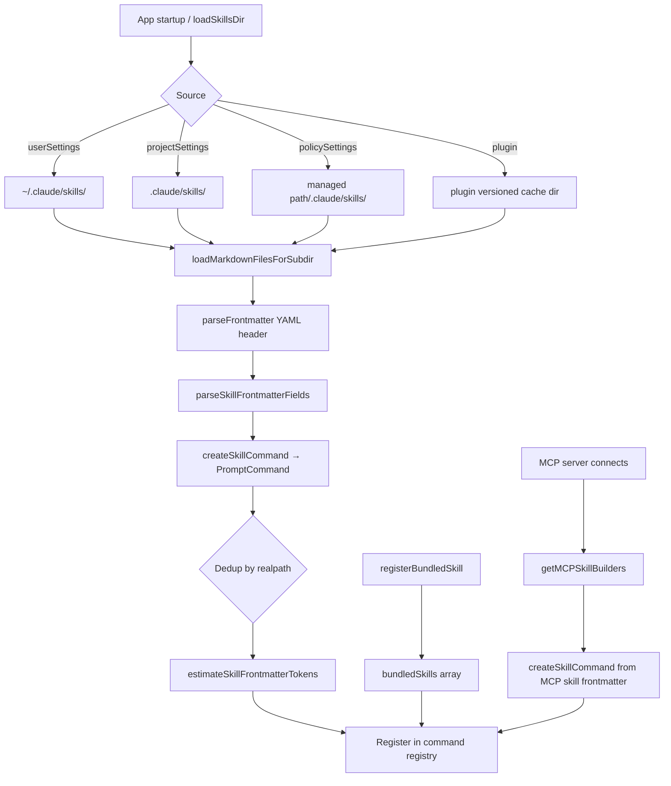
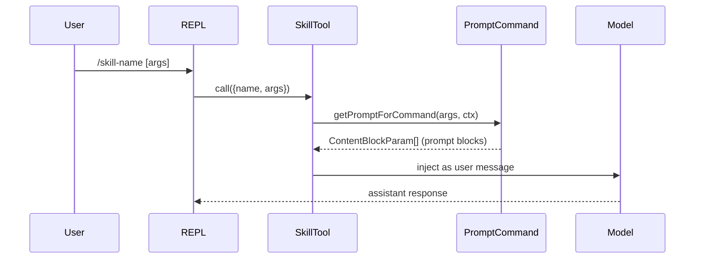

# Skill System

## 1. Purpose

Skills (formerly "commands") are slash-command extensions that inject a prepared prompt into the conversation, optionally with tool restrictions and hooks. They can be authored as Markdown files with YAML frontmatter (user/project/plugin skills) or registered programmatically in TypeScript (bundled skills). The skill system handles discovery, parsing, deduplication, token estimation, and execution as `PromptCommand` objects inside the tool pipeline.

## 2. Key Files

| File | Size | Role |
|------|------|------|
| `src/skills/loadSkillsDir.ts` | 33.6 KB | Filesystem discovery, frontmatter parsing, dedup, `createSkillCommand` |
| `src/skills/bundledSkills.ts` | 7.3 KB | Programmatic registry (`registerBundledSkill`, `getBundledSkills`) |
| `src/skills/mcpSkillBuilders.ts` | 1.6 KB | Write-once registry bridging `loadSkillsDir` functions to MCP skill discovery |
| `src/skills/bundled/` | 17 files | Built-in skills shipped with the CLI binary |

### Bundled skills (examples)

| Skill | File |
|-------|------|
| `/loop` | `bundled/loop.ts` |
| `/simplify` | `bundled/simplify.ts` |
| `/schedule` | `bundled/scheduleRemoteAgents.ts` |
| `/keybindings` | `bundled/keybindings.ts` |
| `/verify` | `bundled/verify.ts` |
| `/batch` | `bundled/batch.ts` |

## 3. Data Flow

### Discovery and loading



### Execution



## 4. Core Types

### Bundled skill definition

```typescript
// src/skills/bundledSkills.ts
export type BundledSkillDefinition = {
  name: string
  description: string
  aliases?: string[]
  whenToUse?: string
  argumentHint?: string
  allowedTools?: string[]
  model?: string
  disableModelInvocation?: boolean
  userInvocable?: boolean
  isEnabled?: () => boolean
  hooks?: HooksSettings
  context?: 'inline' | 'fork'
  agent?: string
  /**
   * Additional reference files extracted to disk on first invocation.
   * Keys: relative paths (no ..); Values: file content.
   * Skill prompt is prefixed with "Base directory for this skill: <dir>".
   */
  files?: Record<string, string>
  getPromptForCommand: (
    args: string,
    context: ToolUseContext,
  ) => Promise<ContentBlockParam[]>
}
```

### Loaded skill (PromptCommand)

```typescript
// src/types/command.ts
export type PromptCommand = {
  type: 'prompt'
  name: string
  description: string
  source: SettingSource | 'plugin' | 'bundled' | 'mcp'
  loadedFrom: LoadedFrom
  allowedTools: string[]
  argumentHint?: string
  whenToUse?: string
  model?: ReturnType<typeof parseUserSpecifiedModel>
  disableModelInvocation: boolean
  userInvocable: boolean
  contentLength: number
  hooks?: HooksSettings
  skillRoot?: string      // base dir for skills with bundled reference files
  context?: 'inline' | 'fork'
  agent?: string
  isEnabled?: () => boolean
  isHidden: boolean
  progressMessage: string
  getPromptForCommand(args: string, ctx: ToolUseContext): Promise<ContentBlockParam[]>
}
```

### Skill frontmatter fields (parsed from Markdown)

```typescript
// src/skills/loadSkillsDir.ts (return of parseSkillFrontmatterFields)
{
  displayName: string | undefined
  description: string
  hasUserSpecifiedDescription: boolean
  allowedTools: string[]
  argumentHint: string | undefined
  argumentNames: string[]
  whenToUse: string | undefined
  version: string | undefined
  model: ReturnType<typeof parseUserSpecifiedModel> | undefined
  disableModelInvocation: boolean
  // plus: hooks, paths, context, agent, userInvocable ...
}
```

### MCP skill builder registry

```typescript
// src/skills/mcpSkillBuilders.ts
export type MCPSkillBuilders = {
  createSkillCommand: typeof createSkillCommand
  parseSkillFrontmatterFields: typeof parseSkillFrontmatterFields
}
export function registerMCPSkillBuilders(b: MCPSkillBuilders): void
export function getMCPSkillBuilders(): MCPSkillBuilders
```

## 5. Integration Points

| Subsystem | How it connects |
|-----------|-----------------|
| **Plugin system** | Plugin-contributed skills are loaded from the plugin's versioned cache directory using the same `loadSkillsDir` machinery, with `source: 'plugin'` |
| **MCP client** | When an MCP server provides skills via its tool list, `getMCPSkillBuilders()` supplies `createSkillCommand` and `parseSkillFrontmatterFields` to the MCP skill loader (`mcpSkills.ts`) |
| **Command registry** | All sources ultimately produce `Command` objects registered in the central command registry consulted by the REPL's `/` completion and the `SkillTool` |
| **Hooks system** | Skills can declare `hooks` in frontmatter (validated against `HooksSchema`); these fire at pre/post invocation, same as project-level hooks in `settings.json` |
| **Settings** | `loadSkillsDir` calls `isSettingSourceEnabled` and `isRestrictedToPluginOnly` to gate which sources are active; respects policy restrictions |
| **Token budget** | `estimateSkillFrontmatterTokens` provides cheap token estimates (name + description + whenToUse) for system prompt budget calculation without loading full skill content |

## 6. Design Decisions

**Frontmatter-first, body-on-demand.** Skill files are parsed in two stages: frontmatter is read eagerly at startup for registration (name, description, tool restrictions), while the full body is only read when the skill is actually invoked via `getPromptForCommand`. This keeps startup cost proportional to the number of skills, not their content size.

**Deduplication via `realpath`.** Overlapping scan directories (e.g., `~/.claude/skills` symlinked into a project) would otherwise register duplicate skills. `getFileIdentity` resolves symlinks to canonical paths before building the dedup set, avoiding false duplicates on virtual/container filesystems where inodes are unreliable.

**`mcpSkillBuilders` write-once registry (no circular imports).** MCP skill discovery needs `createSkillCommand` from `loadSkillsDir`, but `loadSkillsDir` transitively reaches most of the codebase. A direct import would create dependency cycles. The solution is a write-once singleton registered at `loadSkillsDir` module init time; MCP skill code reads it without importing the module directly.

**Bundled reference files with `O_EXCL|O_NOFOLLOW`.** When a bundled skill includes reference files (`files: {}`), they are extracted to a per-process nonce directory under a predictable parent. The write uses `O_EXCL` (fail if exists) and `O_NOFOLLOW` (no symlink follow on the final component) to prevent TOCTOU attacks on the extraction path. The nonce itself is the primary defense; the flags are belt-and-suspenders.

**`context: 'fork'` vs `'inline'`.** An `'inline'` skill injects its prompt into the current conversation context. A `'fork'` skill runs in an isolated agent context so it cannot read or modify the parent conversation's message history. This lets complex skills like `/simplify` operate on a code snapshot without polluting the main thread.

**Skill source hierarchy.** `policySettings` (managed) > `userSettings` > `projectSettings` > `plugin`. Skills from higher-priority sources shadow lower-priority ones with the same name, which lets administrators deploy canonical versions of skills that project-local versions cannot override.
