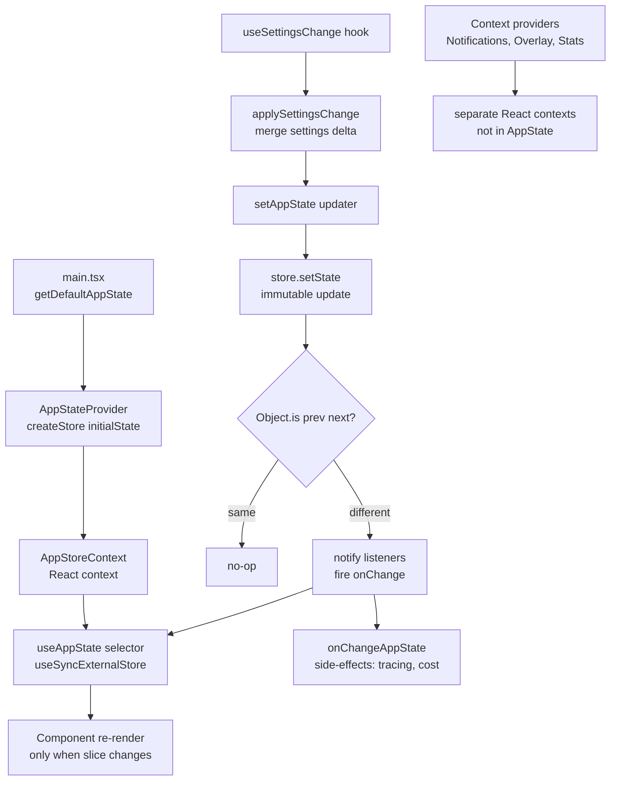

# State Management

## 1. Purpose

Claude Code uses a central `AppState` store backed by a lightweight hand-rolled publish/subscribe store (`src/state/store.ts`). React components subscribe to slices of this store via the `useAppState` selector hook, which re-renders only when the selected value changes. Context providers for cross-cutting concerns (notifications, overlays, stats, voice) live alongside the main store without coupling to it.

## 2. Key Files

| File | Size | Role |
|------|------|------|
| `src/state/AppStateStore.ts` | 21 KB | `AppState` type, `getDefaultAppState()`, `IDLE_SPECULATION_STATE` |
| `src/state/AppState.tsx` | 23 KB | `AppStateProvider`, `useAppState`, `useSetAppState` hooks |
| `src/state/store.ts` | 836 B | Generic `Store<T>` factory with `getState/setState/subscribe` |
| `src/state/onChangeAppState.ts` | 6 KB | Side-effect runner on state transitions (session tracing, cost sync) |
| `src/state/selectors.ts` | 2 KB | Derived selectors over `AppState` |
| `src/context/notifications.tsx` | 32 KB | Notification queue context |
| `src/context/overlayContext.tsx` | 14 KB | Modal overlay stack context |
| `src/context/stats.tsx` | 21 KB | Session statistics context |
| `src/context/voice.tsx` | 9 KB | Voice integration context (DCE: ant-only) |
| `src/context/mailbox.tsx` | 3 KB | Inter-agent mailbox context |
| `src/context/fpsMetrics.tsx` | 3 KB | FPS tracking context |
| `src/context/modalContext.tsx` | 6 KB | Modal dialog context |

### Migrations

| File | Role |
|------|------|
| `src/migrations/migrateAutoUpdatesToSettings.ts` | Move auto-update flag from config to settings |
| `src/migrations/migrateBypassPermissionsAcceptedToSettings.ts` | Migrate bypass-permissions acceptance flag |
| `src/migrations/migrateEnableAllProjectMcpServersToSettings.ts` | MCP server enablement flag migration |
| `src/migrations/migrateFennecToOpus.ts` | Rename legacy model alias |
| `src/migrations/migrateLegacyOpusToCurrent.ts` | Upgrade old opus model string |
| `src/migrations/migrateOpusToOpus1m.ts` | 1M context model rename |
| `src/migrations/migrateSonnet1mToSonnet45.ts` | Sonnet model string migration |
| `src/migrations/migrateSonnet45ToSonnet46.ts` | Sonnet 4.5 → 4.6 migration |
| `src/migrations/migrateReplBridgeEnabledToRemoteControlAtStartup.ts` | Bridge flag rename |
| `src/migrations/resetAutoModeOptInForDefaultOffer.ts` | Reset auto-mode opt-in on new default |
| `src/migrations/resetProToOpusDefault.ts` | Reset Pro plan model default |

## 3. Data Flow



## 4. Core Types

```typescript
// src/state/store.ts — generic foundation
export type Store<T> = {
  getState: () => T
  setState: (updater: (prev: T) => T) => void
  subscribe: (listener: Listener) => () => void
}

// src/state/AppStateStore.ts — selected fields of AppState
export type AppState = DeepImmutable<{
  settings: SettingsJson
  verbose: boolean
  mainLoopModel: ModelSetting
  mainLoopModelForSession: ModelSetting
  toolPermissionContext: ToolPermissionContext
  kairosEnabled: boolean
  replBridgeEnabled: boolean
  replBridgeConnected: boolean
  remoteConnectionStatus: 'connecting' | 'connected' | 'reconnecting' | 'disconnected'
  thinkingEnabled: boolean | undefined
  promptSuggestionEnabled: boolean
  // ... many more fields (see AppStateStore.ts)
}> & {
  // excluded from DeepImmutable because they contain function types
  tasks: { [taskId: string]: TaskState }
  agentNameRegistry: Map<string, AgentId>
  mcp: {
    clients: MCPServerConnection[]
    tools: Tool[]
    commands: Command[]
    resources: Record<string, ServerResource[]>
    pluginReconnectKey: number
  }
  plugins: {
    enabled: LoadedPlugin[]
    disabled: LoadedPlugin[]
    errors: PluginError[]
    needsRefresh: boolean
  }
  agentDefinitions: AgentDefinitionsResult
  fileHistory: FileHistoryState
  attribution: AttributionState
  todos: { [agentId: string]: TodoList }
  notifications: { current: Notification | null; queue: Notification[] }
  elicitation: { queue: ElicitationRequestEvent[] }
  teamContext?: { teamName: string; teammates: { [id: string]: {...} } }
}

// src/state/AppStateStore.ts — speculation for next-turn prefetch
export type SpeculationState =
  | { status: 'idle' }
  | {
      status: 'active'
      id: string
      abort: () => void
      startTime: number
      messagesRef: { current: Message[] }
      writtenPathsRef: { current: Set<string> }
      boundary: CompletionBoundary | null
    }
```

## 5. Integration Points

| Connects To | Via |
|-------------|-----|
| React components | `useAppState(selector)` — slice subscription via `useSyncExternalStore` |
| QueryEngine / query.ts | `getAppState` / `setAppState` callbacks injected at construction |
| Settings system | `useSettingsChange` hook → `applySettingsChange` → `store.setState` |
| onChangeAppState | `createStore(state, onChangeAppState)` — fired on every state transition |
| Migrations | Executed once at startup in `main.tsx` before `AppStateProvider` mounts |
| Context providers | Composed inside `AppStateProvider` via `MailboxProvider`, `VoiceProvider` |

## 6. Design Decisions

- **Hand-rolled store over Redux/Zustand**: The `Store<T>` in `store.ts` is 34 lines. It uses `Object.is` identity checks to skip no-op updates and a plain `Set<Listener>` for subscriptions — no middleware, no devtools overhead, no external dependency.
- **`useSyncExternalStore` for tearing safety**: `useAppState` calls React's `useSyncExternalStore` so concurrent-mode renders stay consistent with the external store, avoiding the "tearing" problem where different components see different state snapshots in the same paint.
- **`DeepImmutable` enforces one-way data flow**: Most of `AppState` is wrapped in `DeepImmutable<...>`, making TypeScript reject any attempt to mutate state in place. The only exceptions are `tasks`, `agentNameRegistry`, and other fields that hold mutable function types, which are excluded from the wrapper explicitly.
- **Voice context DCE**: `VoiceProvider` is conditionally required via `feature('VOICE_MODE')` at the top of `AppState.tsx`. External (non-Anthropic) builds get a pass-through wrapper that adds zero runtime cost.
- **Migrations run at startup, not lazily**: All settings migrations execute sequentially in `main.tsx` before any UI renders. This keeps migration logic simple (no version checks needed inside components) and ensures the settings shape is stable before any component reads it.
- **Separate contexts for volatile UI state**: Notifications, overlays, and stats change frequently and affect only a subset of the component tree. Keeping them in their own React contexts avoids triggering `AppState` subscribers on every notification arrival.
