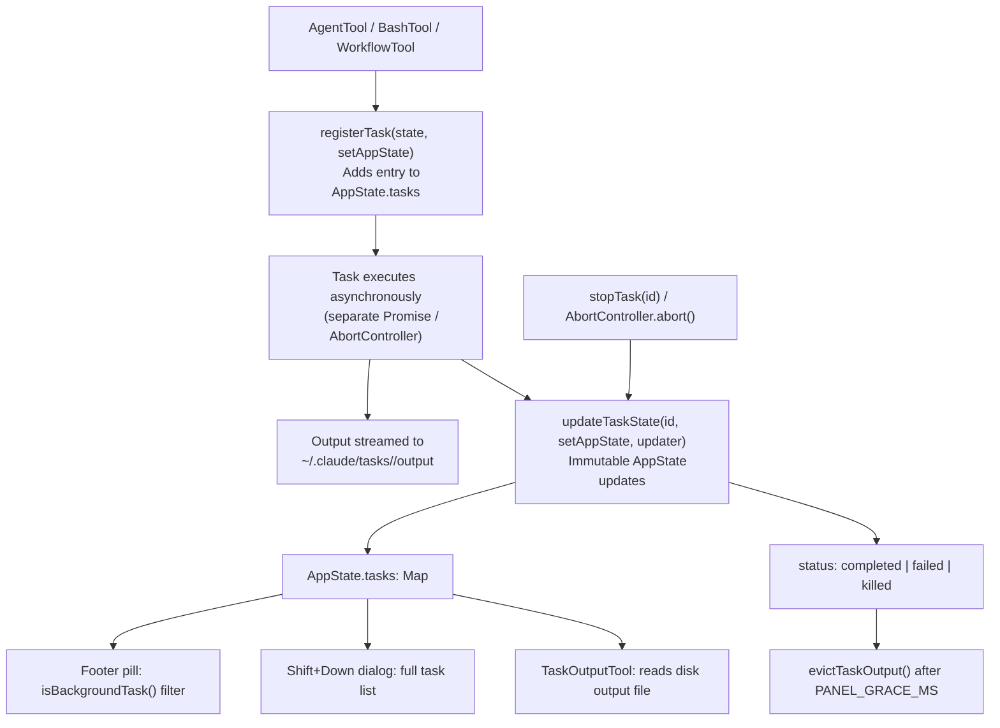

# Task System

## 1. Purpose

The task system tracks long-running background work — shell commands, subagent runs, workflows, and memory consolidation — as first-class state in `AppState`. Each task has a lifecycle (pending → running → completed/failed/killed), produces output streamed to disk, and is surfaced in the footer indicator and the Shift+Down dialog. The system decouples execution (which happens in various async contexts) from UI rendering (which reads immutable `AppState` snapshots).

## 2. Key Files

| File | Size | Role |
|---|---|---|
| `src/Task.ts` | 3.1 KB | `TaskType`, `TaskStatus`, `TaskStateBase`, `Task` interface, `TaskContext`, `SetAppState` |
| `src/tasks.ts` | 1.3 KB | `getAllTasks()`, `getTaskByType()`: registry of all task handlers |
| `src/tasks/types.ts` | 1.7 KB | `TaskState` union type, `BackgroundTaskState`, `isBackgroundTask()` |
| `src/tasks/LocalShellTask/LocalShellTask.tsx` | 64.8 KB | Shell command execution, output streaming, foreground/background mode |
| `src/tasks/LocalShellTask/guards.ts` | 1.5 KB | `LocalShellTaskState` type and `isLocalShellTask()` guard |
| `src/tasks/LocalAgentTask/LocalAgentTask.tsx` | 81.0 KB | Subagent (AgentTool) execution, progress tracking, transcript streaming |
| `src/tasks/RemoteAgentTask/RemoteAgentTask.tsx` | 123.4 KB | Remote agent execution over network |
| `src/tasks/InProcessTeammateTask/InProcessTeammateTask.tsx` | 16.0 KB | In-process teammate runner |
| `src/tasks/InProcessTeammateTask/types.ts` | 4.2 KB | `InProcessTeammateTaskState`, `TeammateIdentity`, message cap |
| `src/tasks/DreamTask/DreamTask.ts` | 4.9 KB | Memory consolidation background agent (KAIROS_DREAM) |
| `src/tasks/LocalMainSessionTask.ts` | 14.8 KB | Main session task lifecycle (non-background) |
| `src/tasks/stopTask.ts` | 2.8 KB | `stopTask()`: unified kill dispatch |
| `src/tasks/pillLabel.ts` | 2.8 KB | Status pill label text for footer display |
| `src/utils/task/framework.ts` | — | `registerTask()`, `updateTaskState()`, `PANEL_GRACE_MS` |
| `src/utils/task/diskOutput.ts` | — | `getTaskOutputPath()`, `initTaskOutputAsSymlink()`, `evictTaskOutput()` |

## 3. Data Flow



## 4. Core Types

### `TaskStateBase` — shared by all task types

```typescript
// src/Task.ts
export type TaskStateBase = {
  id: string
  type: TaskType
  status: 'pending' | 'running' | 'completed' | 'failed' | 'killed'
  description: string
  toolUseId?: string
  startTime: number
  endTime?: number
  totalPausedMs?: number
  outputFile: string    // Path to disk output file
  outputOffset: number  // Read offset for incremental TaskOutputTool reads
  notified: boolean     // Whether completion was surfaced to the user
}
```

### `TaskState` union — all 7 concrete types

```typescript
// src/tasks/types.ts
export type TaskState =
  | LocalShellTaskState      // type: 'local_bash'
  | LocalAgentTaskState      // type: 'local_agent'
  | RemoteAgentTaskState     // type: 'remote_agent'
  | InProcessTeammateTaskState // type: 'in_process_teammate'
  | LocalWorkflowTaskState   // type: 'local_workflow'  (WORKFLOW_SCRIPTS)
  | MonitorMcpTaskState      // type: 'monitor_mcp'     (MONITOR_TOOL)
  | DreamTaskState           // type: 'dream'
```

### Per-type highlights

**`LocalShellTaskState`** (`src/tasks/LocalShellTask/guards.ts`)
```typescript
type LocalShellTaskState = TaskStateBase & {
  type: 'local_bash'
  command: string
  result?: { code: number; interrupted: boolean }
  shellCommand: ShellCommand | null
  isBackgrounded: boolean     // false = foreground (blocking), true = backgrounded
  agentId?: AgentId           // set when spawned by a subagent
  kind?: 'bash' | 'monitor'  // 'monitor' → different UI pill label
  lastReportedTotalLines: number
}
```

**`LocalAgentTaskState`** — key fields from `LocalAgentTask.tsx`
```typescript
type LocalAgentTaskState = TaskStateBase & {
  type: 'local_agent'
  progress?: AgentProgress    // { toolUseCount, tokenCount, lastActivity, recentActivities, summary }
  messages?: Message[]
  result?: AgentToolResult
  abortController?: AbortController
  // ...
}
```

**`InProcessTeammateTaskState`** (`src/tasks/InProcessTeammateTask/types.ts`)
```typescript
type InProcessTeammateTaskState = TaskStateBase & {
  type: 'in_process_teammate'
  identity: TeammateIdentity   // { agentId, agentName, teamName, color, ... }
  prompt: string
  model?: string
  permissionMode: PermissionMode
  isIdle: boolean
  shutdownRequested: boolean
  awaitingPlanApproval: boolean
  messages?: Message[]         // Capped at TEAMMATE_MESSAGES_UI_CAP (50) entries
  pendingUserMessages: string[]
  progress?: AgentProgress
  // ... (runtime-only fields: abortController, onIdleCallbacks, etc.)
}
```

**`DreamTaskState`** (`src/tasks/DreamTask/DreamTask.ts`)
```typescript
type DreamTaskState = TaskStateBase & {
  type: 'dream'
  phase: 'starting' | 'updating'
  sessionsReviewing: number
  filesTouched: string[]
  turns: DreamTurn[]           // { text: string; toolUseCount: number }[]
  priorMtime: number           // For consolidation lock rollback
}
```

**`LocalWorkflowTaskState`** — gated by `WORKFLOW_SCRIPTS` feature flag.

**`MonitorMcpTaskState`** — gated by `MONITOR_TOOL` feature flag.

### `Task` interface (handler object)

```typescript
// src/Task.ts
export type Task = {
  name: string
  type: TaskType
  kill(taskId: string, setAppState: SetAppState): Promise<void>
}
```

## 5. Integration Points

- **Tool system**: `AgentTool` creates `LocalAgentTaskState`; `BashTool` creates `LocalShellTaskState`; `WorkflowTool` creates `LocalWorkflowTaskState`. `TaskOutputTool` reads from `outputFile` using `outputOffset` for incremental delivery.
- **AppState**: All task state lives in `AppState.tasks: Map<string, TaskState>`. The `setAppStateForTasks` path in `ToolUseContext` ensures background agents (whose `setAppState` is otherwise a no-op) can still update the root store for task registration and cleanup.
- **Disk output**: Task output is written to `~/.claude/tasks/<id>/output`. `initTaskOutputAsSymlink` creates the initial file; `evictTaskOutput` cleans it up after `PANEL_GRACE_MS` following task completion.
- **Permission system**: Async agents that have tasks in flight set `shouldAvoidPermissionPrompts: true` to prevent hanging on UI permission dialogs. `InProcessTeammateTask` tracks its own `permissionMode` independently.
- **Feature flags**: `LocalWorkflowTask` and `MonitorMcpTask` are conditionally required via `feature('WORKFLOW_SCRIPTS')` and `feature('MONITOR_TOOL')` in `src/tasks.ts`, mirroring the tool registration pattern in `src/tools.ts`.

## 6. Design Decisions

- **Immutable state updates via `updateTaskState`**: All modifications go through `setAppState`, producing a new `AppState` snapshot. This ensures React components re-render correctly and prevents race conditions between concurrent tool calls updating the same task.
- **Disk-backed output**: Writing task output to disk rather than keeping it in memory avoids AppState bloat for long-running commands (e.g., a 10-minute build). `TaskOutputTool` reads incrementally using `outputOffset`, so large outputs don't require re-reading from the start.
- **`InProcessTeammateTask` message cap**: The `TEAMMATE_MESSAGES_UI_CAP` of 50 messages prevents the `messages` array (used only for the zoomed transcript dialog) from causing multi-GB RSS in swarm sessions. The full conversation lives on disk at the agent transcript path.
- **`isBackgrounded` flag on shell tasks**: A task starts with `isBackgrounded: false` (foreground), blocking the next user turn. When backgrounded by the user (e.g., by sending a new message), it transitions to `true`, allowing the REPL to proceed.
- **`DreamTask` has no `InProcessTeammateTask` integration**: The dream agent is a forked subagent, not a teammate. Its task record is purely a UI surface — the actual agent runs via the standard agent fork path. The `filesTouched` array is an incomplete reflection derived from observable tool calls only.
