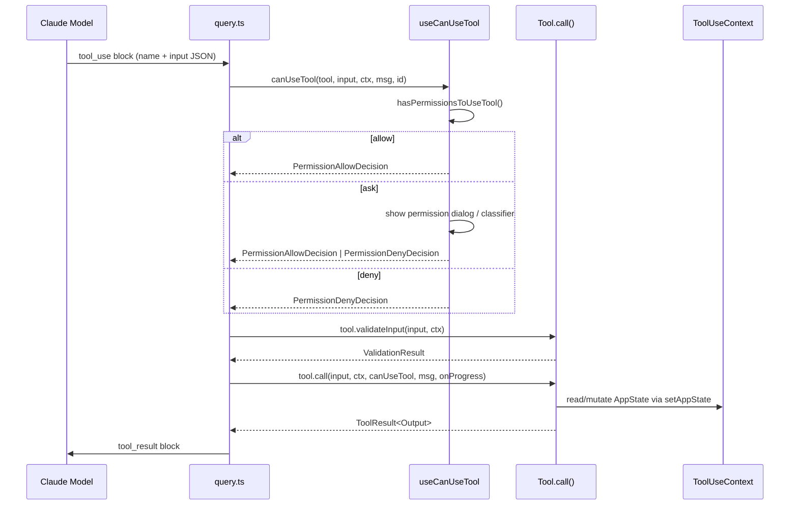

# Tool System

## 1. Purpose

The tool system is the mechanism through which Claude invokes concrete actions: reading files, running shell commands, searching the web, spawning subagents, and more. Every capability available to the model is expressed as a `Tool`, with a uniform interface for input validation, permission checking, execution, and UI rendering. The central registry in `src/tools.ts` assembles the active tool pool at runtime, filtering by feature flags, environment variables, and user permission context.

## 2. Key Files

| File | Size | Role |
|---|---|---|
| `src/Tool.ts` | ~800 lines | Core `Tool<Input, Output, P>` generic type, `ToolUseContext`, `ToolResult`, `buildTool` factory |
| `src/tools.ts` | ~390 lines | `getAllBaseTools()`, `getTools()`, `assembleToolPool()`, feature-flag-gated conditional imports |
| `src/tools/*/` | 42 directories | Individual tool implementations, one directory per tool |
| `src/types/tools.ts` | — | Centralized progress-data types (`BashProgress`, `AgentToolProgress`, etc.) |
| `src/constants/tools.ts` | — | Allow/deny list constants (`ALL_AGENT_DISALLOWED_TOOLS`, etc.) |

### Tool Directories by Category

| Category | Tools |
|---|---|
| File operations | `FileReadTool`, `FileEditTool`, `FileWriteTool`, `NotebookEditTool` |
| Search | `GlobTool`, `GrepTool` |
| Execution | `BashTool`, `REPLTool` (ant-only), `PowerShellTool` |
| Multi-agent | `AgentTool`, `TaskCreateTool`, `TaskGetTool`, `TaskUpdateTool`, `TaskListTool`, `TaskStopTool`, `TaskOutputTool`, `SendMessageTool`, `TeamCreateTool`, `TeamDeleteTool` |
| Config/meta | `ConfigTool`, `EnterPlanModeTool`, `ExitPlanModeTool`, `EnterWorktreeTool`, `ExitWorktreeTool`, `ToolSearchTool` |
| Utilities | `WebFetchTool`, `WebSearchTool`, `TodoWriteTool`, `AskUserQuestionTool`, `SkillTool`, `BriefTool`, `SleepTool`, `LSPTool` |
| MCP | `MCPTool`, `ListMcpResourcesTool`, `ReadMcpResourceTool`, `McpAuthTool` |
| Workflows (flag-gated) | `WorkflowTool` (WORKFLOW_SCRIPTS), `MonitorTool` (MONITOR_TOOL), `ScheduleCronTool` (AGENT_TRIGGERS) |

## 3. Data Flow



## 4. Core Types

```typescript
// Generic tool type — Input/Output/Progress all parameterized
export type Tool<
  Input extends AnyObject = AnyObject,
  Output = unknown,
  P extends ToolProgressData = ToolProgressData,
> = {
  readonly name: string
  aliases?: string[]
  readonly inputSchema: Input                       // Zod schema
  readonly inputJSONSchema?: ToolInputJSONSchema    // For MCP tools
  isConcurrencySafe(input: z.infer<Input>): boolean
  isReadOnly(input: z.infer<Input>): boolean
  isDestructive?(input: z.infer<Input>): boolean
  isEnabled(): boolean
  checkPermissions(input, context): Promise<PermissionResult>
  validateInput?(input, context): Promise<ValidationResult>
  call(args, context, canUseTool, parentMessage, onProgress?): Promise<ToolResult<Output>>
  mapToolResultToToolResultBlockParam(content, toolUseID): ToolResultBlockParam
  // ... rendering methods (renderToolResultMessage, renderToolUseMessage, etc.)
  maxResultSizeChars: number
  readonly shouldDefer?: boolean   // Requires ToolSearch round-trip before use
  readonly alwaysLoad?: boolean    // Always included in initial prompt
}

// Lightweight factory with safe defaults
export function buildTool<D extends AnyToolDef>(def: D): BuiltTool<D>

// Runtime context passed to every tool call
export type ToolUseContext = {
  options: {
    commands: Command[]
    tools: Tools
    mainLoopModel: string
    mcpClients: MCPServerConnection[]
    // ...
  }
  abortController: AbortController
  readFileState: FileStateCache
  getAppState(): AppState
  setAppState(f: (prev: AppState) => AppState): void
  setAppStateForTasks?: (f) => void   // Session-scoped; always reaches root store
  messages: Message[]
  agentId?: AgentId                   // Set only for subagents
  setInProgressToolUseIDs: (f) => void
  updateFileHistoryState: (updater) => void
  // ... (30+ additional fields)
}

// Tool call result
export type ToolResult<T> = {
  data: T
  newMessages?: (UserMessage | AssistantMessage | AttachmentMessage | SystemMessage)[]
  contextModifier?: (context: ToolUseContext) => ToolUseContext
  mcpMeta?: { _meta?: Record<string, unknown>; structuredContent?: Record<string, unknown> }
}
```

## 5. Integration Points

- **Permission system**: Every tool call flows through `canUseTool` (from `useCanUseTool` hook) before execution. `Tool.checkPermissions()` contains tool-specific logic; `hasPermissionsToUseTool()` applies global rules.
- **Command system**: `ToolUseContext.options.commands` exposes slash commands to tools. `SkillTool` and `WorkflowTool` invoke commands by name from this list.
- **MCP**: `MCPTool` wrappers are created dynamically from `MCPServerConnection` objects and merged into the pool via `assembleToolPool()`. MCP tools carry an `mcpInfo` field identifying their origin server.
- **Task system**: `AgentTool`, `TaskCreateTool`, and related tools create and manage entries in `AppState.tasks`. `TaskOutputTool` streams output back from background tasks.
- **Feature flags**: Tool registration in `getAllBaseTools()` is controlled by `feature()` checks (`bun:bundle` DCE) and `process.env` guards. Tools not included at bundle time have zero runtime cost.
- **ToolSearch**: When the total tool count exceeds a threshold, most tools are deferred (`shouldDefer: true`) and replaced by `ToolSearchTool` for discovery.

## 6. Design Decisions

- **Generic type parameters**: `Tool<Input, Output, P>` avoids casting in tool implementations while keeping the registry typed as `Tool[]` (type-erased). `buildTool` uses structural inference to preserve literal types.
- **`buildTool` defaults are fail-closed**: `isConcurrencySafe` defaults to `false` (serialized), `checkPermissions` defaults to `allow` (defers to the global system), `isDestructive` defaults to `false`.
- **`maxResultSizeChars` budget**: Results exceeding the limit are persisted to disk and replaced with a file-path reference, preventing context-window bloat. `FileReadTool` sets this to `Infinity` to avoid a circular Read-file-Read loop.
- **`isTransparentWrapper`**: Tools like `REPLTool` delegate all rendering to their progress handler and show nothing themselves, enabling composable UI without duplicate output.
- **Tool deduplication in `assembleToolPool`**: Built-ins are sorted and prepended; MCP tools are sorted and appended; `uniqBy(name)` ensures built-ins win on name collision. Sorting within each partition preserves prompt-cache stability.
