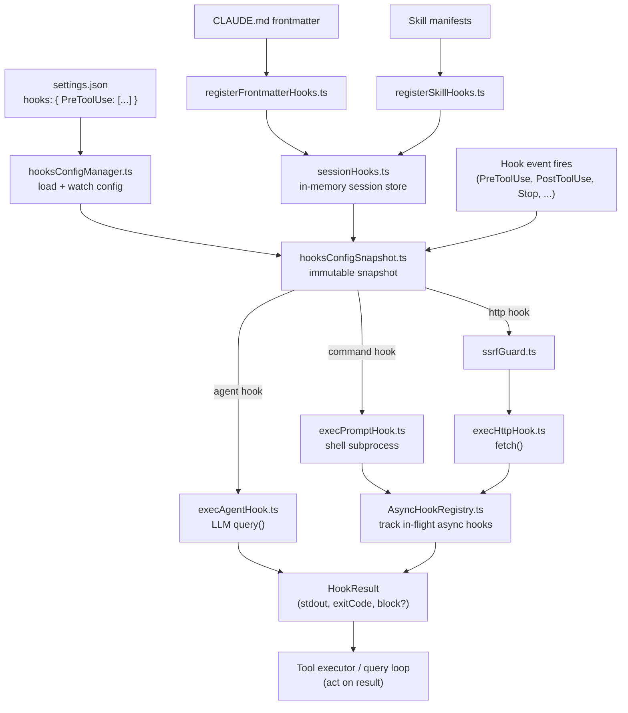

# User-Configurable Extensibility Hooks

## 1. Purpose

`src/utils/hooks/` implements the user-facing automation and extensibility system that allows external processes to intercept and react to Claude Code lifecycle events. These are **not** React hooks — they are shell commands, HTTP endpoints, or LLM agent callbacks that the user declares in `settings.json` and that fire at defined points in the Claude Code session lifecycle. They are the mechanism behind the `hooks:` configuration section documented in the Claude Code user guide.

## 2. Key Files

| File | Approx. size | Role |
|---|---|---|
| `src/utils/hooks/hooksSettings.ts` | 8.3 KB | Hook config types, `getAllHooks()`, matcher/priority sorting |
| `src/utils/hooks/hooksConfigManager.ts` | 17 KB | Reads and manages the hooks configuration from settings |
| `src/utils/hooks/hooksConfigSnapshot.ts` | 4.9 KB | Immutable config snapshot used per-event invocation |
| `src/utils/hooks/execAgentHook.ts` | 12 KB | Executes an agent-type hook via multi-turn LLM query |
| `src/utils/hooks/execHttpHook.ts` | 8.7 KB | Executes an HTTP hook via SSRF-guarded fetch |
| `src/utils/hooks/execPromptHook.ts` | 6.7 KB | Executes a prompt/command hook via shell subprocess |
| `src/utils/hooks/sessionHooks.ts` | 11.8 KB | In-memory session-scoped hook registry (ephemeral, not persisted) |
| `src/utils/hooks/AsyncHookRegistry.ts` | 8.7 KB | Global registry for in-flight async hooks |
| `src/utils/hooks/ssrfGuard.ts` | 8.5 KB | IP address validation for HTTP hooks |
| `src/utils/hooks/hookEvents.ts` | 4.4 KB | Hook progress signalling and event emission |
| `src/utils/hooks/hookHelpers.ts` | 2.5 KB | Shared utilities (`addArgumentsToPrompt`, structured output schema) |
| `src/utils/hooks/postSamplingHooks.ts` | 1.9 KB | Hooks that run after model sampling completes |
| `src/utils/hooks/registerFrontmatterHooks.ts` | 2.2 KB | Registers hooks declared in CLAUDE.md frontmatter |
| `src/utils/hooks/registerSkillHooks.ts` | 2.0 KB | Registers hooks declared in skill manifests |
| `src/utils/hooks/sessionHooks.ts` | 11.8 KB | Session-scoped in-memory hook store |
| `src/utils/hooks/skillImprovement.ts` | 8.2 KB | Skill improvement feedback hooks |
| `src/utils/hooks/fileChangedWatcher.ts` | 5.2 KB | File-watch hook trigger |
| `src/utils/hooks/apiQueryHookHelper.ts` | 4.3 KB | Shared query helper for agent hooks |

## 3. Data Flow



## 4. Core Types

### Hook event names

```ts
// Defined in src/entrypoints/agentSdkTypes.ts
type HookEvent =
  | 'PreToolUse'
  | 'PostToolUse'
  | 'PostToolUseFailure'
  | 'PermissionDenied'
  | 'Notification'
  | 'UserPromptSubmit'
  | 'SessionStart'
  | 'Stop'
  | 'StopFailure'
```

### Hook config shapes (`hooksSettings.ts`)

```ts
type HookCommand = {
  type: 'command'
  command: string
  timeout?: number
  matcher?: string
}

type AgentHook = {
  type: 'agent'
  prompt: string
  timeout?: number
  matcher?: string
}

type HttpHook = {
  type: 'http'
  url: string
  method?: 'GET' | 'POST'
  timeout?: number
  matcher?: string
}

type IndividualHookConfig = HookCommand | AgentHook | HttpHook
```

### Session-scoped function hooks (`sessionHooks.ts`)

```ts
type FunctionHookCallback = (
  messages: Message[],
  signal?: AbortSignal,
) => boolean | Promise<boolean>

type FunctionHook = {
  type: 'function'
  id?: string
  timeout?: number
  callback: FunctionHookCallback
  errorMessage: string
  statusMessage?: string
}

type SessionStore = {
  hooks: { [event in HookEvent]?: SessionHookMatcher[] }
}
```

### Async hook registry (`AsyncHookRegistry.ts`)

```ts
type PendingAsyncHook = {
  processId: string
  hookId: string
  hookName: string
  hookEvent: HookEvent | 'StatusLine' | 'FileSuggestion'
  toolName?: string
  pluginId?: string
  startTime: number
  timeout: number
  command: string
  responseAttachmentSent: boolean
  shellCommand?: ShellCommand
  stopProgressInterval: () => void
}
```

## 5. Integration Points

- **Tool executor** (`src/services/tools/toolExecution.ts`) — calls the hook system before (`PreToolUse`) and after (`PostToolUse`, `PostToolUseFailure`) every tool invocation. A hook returning exit code 2 can block the tool call.
- **Query loop** (`src/query.ts`) — fires `Stop` / `StopFailure` hooks after model sampling and routes their output back to the model when exit code 2 is returned.
- **Session initialization** — `SessionStart` hooks fire via `registerFrontmatterHooks.ts` and `registerSkillHooks.ts` at session startup.
- **User prompt pipeline** — `UserPromptSubmit` hooks fire before the prompt reaches the model; exit code 2 blocks and erases the prompt.
- **AppState** — `sessionHooks.ts` uses `setAppState` to write into the Zustand store's `sessionHooks` key (a `Map` for O(1) mutation without triggering listeners).
- **React hook bridge** — `src/hooks/useDeferredHookMessages.ts` surfaces deferred async hook output as React state so the UI can show hook progress.
- **Skill system** (`src/services/plugins/`) — skill manifests can declare hooks via `registerSkillHooks.ts`.

## 6. Design Decisions

**SSRF guard allows loopback, blocks private ranges.** `ssrfGuard.ts` explicitly permits `127.0.0.0/8` and `::1` (for local dev policy servers) while blocking all other private/link-local ranges including `169.254.0.0/16` (cloud metadata). When a proxy is configured the guard is advisory only — the proxy does DNS resolution and applies its own allowlist.

**Three hook execution strategies for different use cases.** Command hooks (`execPromptHook.ts`) run arbitrary shell subprocesses — maximum power, no latency budget. HTTP hooks (`execHttpHook.ts`) target local or remote policy servers — fast, structured. Agent hooks (`execAgentHook.ts`) run a fresh LLM `query()` — highest latency, maximum intelligence. Users choose the right strategy per event.

**Session hooks use a `Map` not a spread-copy `Record`.** Under high-concurrency swarm workflows, N agents calling `addFunctionHook` in one tick would produce O(N²) copy cost with a spread pattern and fire all ~30 Zustand listeners. `Map.set()` is O(1) and returning `prev` unchanged from the state updater means zero listener fires.

**Async hook registry with progress signalling.** Long-running hooks (async mode) are registered in `AsyncHookRegistry.ts` so the UI can display progress via `hookEvents.ts`. The registry tracks `timeout`, `startTime`, and `responseAttachmentSent` to correctly expire stalled hooks.

**Frontmatter and skill hooks are session-scoped.** Hooks declared in `CLAUDE.md` frontmatter or skill manifests are registered into `sessionHooks` (in-memory only) at session start — they are never written back to `settings.json`. This avoids polluting the user's persistent config with per-project or per-skill automation.
