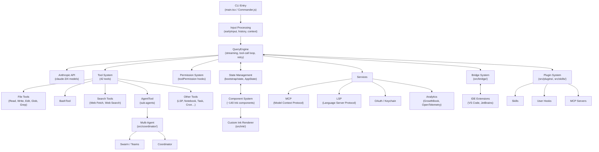

# Claude Code — Documentation

Claude Code is Anthropic's official CLI for Claude, the AI assistant. It is a TypeScript/Bun application with a terminal UI built on a custom React+Ink renderer. From the terminal, Claude Code can read and edit files, run shell commands, search codebases, manage git workflows, browse the web, communicate with IDE extensions, and orchestrate multi-agent workloads — all driven by natural language.

## Repository Scale

| Metric | Count |
|---|---|
| TypeScript source files | 1,884 |
| Lines of code | 512,000+ |
| Agent tools | 42 |
| Slash commands | 103+ |
| Services | 20+ |

## System Diagram

## Sections

| Section | Description |
|---|---|
| [getting-started/](getting-started/) | End users: running commands, configuring settings, managing permissions, and installing plugins |
| [architecture/](architecture/) | Developers: internals of QueryEngine, Tool System, Permission System, State Management, and data flow |
| [extending/](extending/) | Extension authors: writing plugins, skills, MCP servers, LSP integrations, and IDE bridge adapters |
| [reference/](reference/) | Quick-lookup tables for all tools, slash commands, CLI flags, hook types, and service interfaces |
